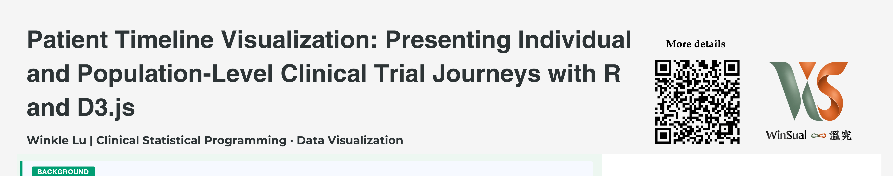
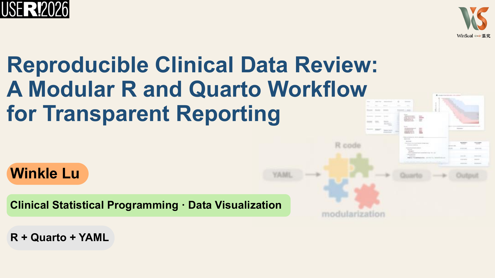
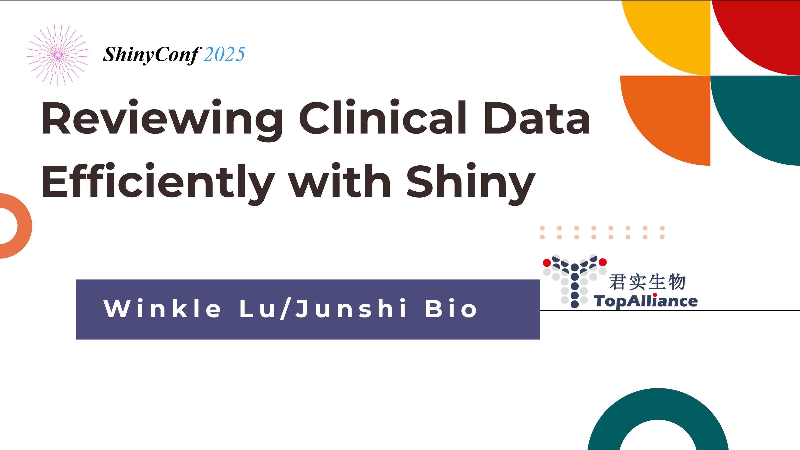
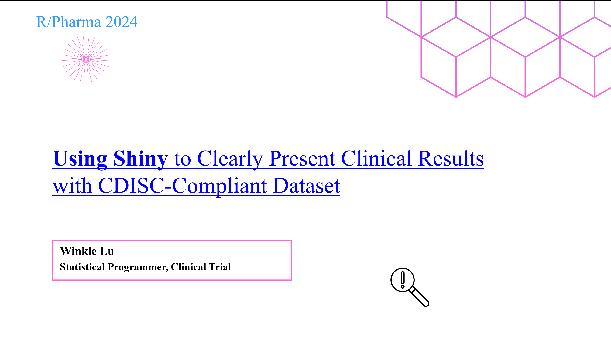
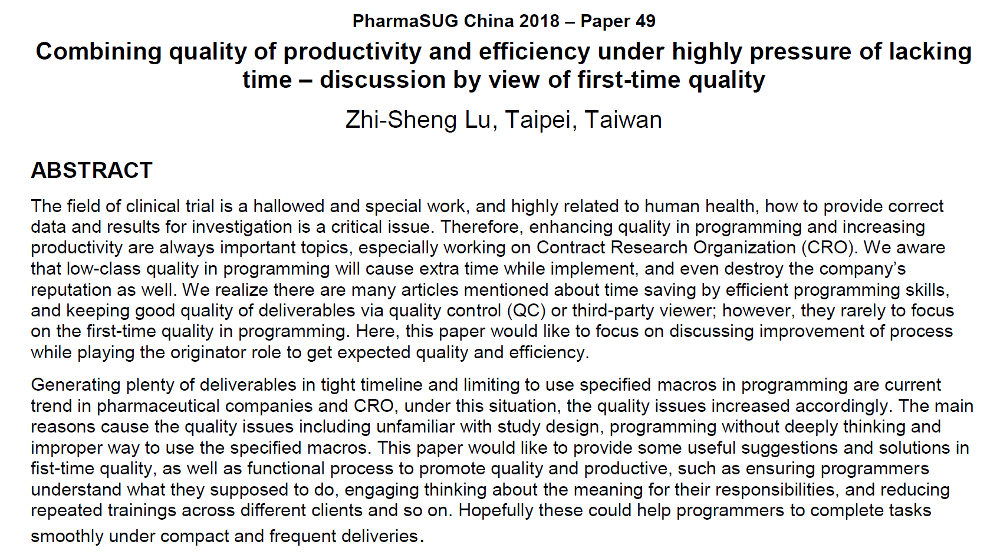

---

### 🔹 useR! 2026 (Poster)

[{width=300px}](slides/useR2026_Poster_Patient_Timeline_Visualization.pdf)

**Title:** Patient Timeline Visualization: Presenting Individual and Population-Level Clinical Trial Journeys with R and D3.js
📍 *Status:* 2026-07-08 — Warsaw
📝 *Summary:*
Clinical trial data analysis typically focuses on specific analysis datasets, but the complete journey of individual patients — from screening, enrollment, and first dose, through visit records and adverse events, to last dose and survival status — represents critical time-based data points that reviewers prioritize. This fragmentation of information forces reviewers to switch between multiple reports during in-depth case reviews.

This poster presents an interactive patient timeline visualization system built with R and D3.js. The single-patient view integrates visit records, medication history, adverse events, and survival status into a clear timeline, providing a complete picture of each patient's key trial journey.

The system also supports side-by-side timeline comparisons across patient subgroups, with event type filtering and time range zoom functionality to help identify population-level event patterns and safety signals.

The system takes raw CRF data as input and embeds D3.js interactive capabilities directly into the R workflow, without requiring a separate front-end development environment. This poster will demonstrate visualizations generated from simulated clinical trial data and discuss the practical potential of this approach in clinical data review and safety monitoring settings.

[📄 Download Poster (PDF)](slides/useR2026_Poster_Patient_Timeline_Visualization.pdf)

---

### 🔹 useR! 2026 (Lightning Talk)

[{width=300px}](slides/useR2026_Lightning_Talk_Reproducible_Clinical_Data_Review.pdf)

**Title:** Reproducible Clinical Data Review: A Modular R and Quarto Workflow for Transparent Reporting
📍 *Status:* 2026-07-07 — Warsaw
📝 *Summary:*
During clinical trials, EDC data must be reviewed regularly — from routine medical review reports to formal audit and inspection scenarios. In these contexts, reviewers do not explore data freely. They follow a predictable, structured process and need a document that clearly records what was seen, under what conditions, and what conclusions were drawn. This core distinction shapes the design philosophy presented in this talk.

This lightning talk introduces a two-layer modular framework built with R and Quarto for clinical data review. The first layer provides pre-built review modules covering demographics, adverse events, medication records, and study endpoints — each encapsulating domain knowledge and visualization logic. The second layer allows reviewers to combine modules and map Case Report Form (CRF) fields through a YAML file, without modifying the main codebase.

A key design decision is to use raw CRF data as input rather than CDISC-compliant datasets. This lowers the cognitive barrier for non-programmer reviewers while maintaining flexibility across different trials.

Every Quarto report produced by this workflow is a decision snapshot: YAML parameters and review conditions are fully preserved, creating a natural record without additional effort.

The workflow will be demonstrated using simulated CRF data, with discussion of practical design trade-offs in programmer-reviewer collaboration settings.

[📄 Download Slides (PDF)](slides/useR2026_Lightning_Talk_Reproducible_Clinical_Data_Review.pdf)

---

### 🔹 R/Pharma 2026 APAC

**Title:** Interactive QTL/KRI Risk Monitoring with Python
*Co-authored with Yuqi He*
📍 *Status:* Accepted, forthcoming

---

### 🔹 R/Pharma 2026 APAC

**Title:** Upstream Detection of CDISC-Compliant Issues: Raw Data Quality Review with Local LLM and R
📍 *Status:* Accepted, forthcoming

---

### 🔹 ShinyConf 2025

[{width=300px}](slides/shinyconf2025_Reviewing_Clinical_Data_Efficiently_with_Shiny.pdf)

**Title:** Reviewing Clinical Data Efficiently with Shiny  
📍 *Date:* 2025-04-12  
📝 *Summary:*  
This presentation introduces a Shiny-based application designed to improve the efficiency of clinical data review. Traditional EDC systems often limit reviewers to viewing data one form and one patient at a time, making it difficult to cross-reference information across forms such as Adverse Events (AE), Exposure (EX), and Concomitant Medication (CM). This tool addresses that challenge by providing a user-friendly, click-driven interface that allows reviewers to select patients, filter forms and variables, and instantly visualize clinical timelines and data listings. The application maintains the original data structure, requires minimal setup by programmers, and is accessible to non-programming users. Key benefits include simultaneous multi-form data review, integrated visualizations and listings, and Excel export functionality. This tool aims to bridge communication gaps between reviewers and programmers while enhancing the speed and clarity of clinical review workflows..

[📄 Download Slides (PDF)](slides/shinyconf2025_Reviewing_Clinical_Data_Efficiently_with_Shiny.pdf)

---

### 🔹 R/Pharma 2024

[{width=300px}](slides/R_Pharma_Using_Shiny_to_Clearly_Present_Clinical_Results_with_CDISC_Compliant_Dataset.pdf)

**Title:** Using Shiny to Clearly Present Clinical Results with CDISC-Compliant Dataset  
📍 *Date:* 2024-10-31  
📝 *Summary:*  
This presentation explores how R and Shiny can enhance the review and visualization of clinical trial data. Traditional workflows often involve repeated back-and-forth verification between datasets such as SDTM, ADaM, and EDC, which is time-consuming. By leveraging R’s Shiny framework, we can streamline data filtering and visualization, enabling faster and more intuitive review processes for both statisticians and medical teams. The talk highlights three key Shiny applications: tumor response visualization, patient milestone tracking, and SDTM domain review. These tools support both population-level summaries and individual-level insights. Emphasis is also placed on the importance of using CDISC-compliant data formats to standardize and simplify data handling. Finally, the integration of Shiny with Quarto is introduced as a future direction to make clinical data more accessible to non-programmers, improving data transparency and efficiency in reporting.

[📄 Download Slides (PDF)](slides/R_Pharma_Using_Shiny_to_Clearly_Present_Clinical_Results_with_CDISC_Compliant_Dataset.pdf)

---

### 🔹 Pharmasug 2018

[{width=300px}](slides/Pharmasug2018_first-time_quality.pdf)

**Title:** Combining Quality of Productivity and Efficiency Under Highly Pressure of Lacking Time – Discussion by View of First-Time Quality

📍 *Date:* 2018-08-31  
📝 *Summary:*  
This paper discusses how to enhance programming quality and efficiency in clinical trials under tight deadlines, especially within CROs. It emphasizes the importance of “first-time quality,” defined as the quality of deliverables before QC review. The author argues that poor initial quality leads to higher correction costs and delays, despite common practices like SOPs, validated macros, and training. A structured QC plan is essential but resource-intensive. The paper highlights factors affecting quality, including unfamiliarity with study design, insufficient task understanding, and client complexity. To address this, the author proposes a "First-Time Quality Scale" that evaluates programmers based on QC comments, client feedback, and satisfaction. High-scoring individuals can be assigned to time-sensitive projects, maximizing both quality and speed. The paper concludes that focusing on first-time quality can reduce repetitive work, save resources, and improve overall outcomes, aligning with the increasing demand for rapid and accurate clinical data processing.

[📄 Download Article (PDF)](slides/Pharmasug2018_first-time_quality.pdf)

---
