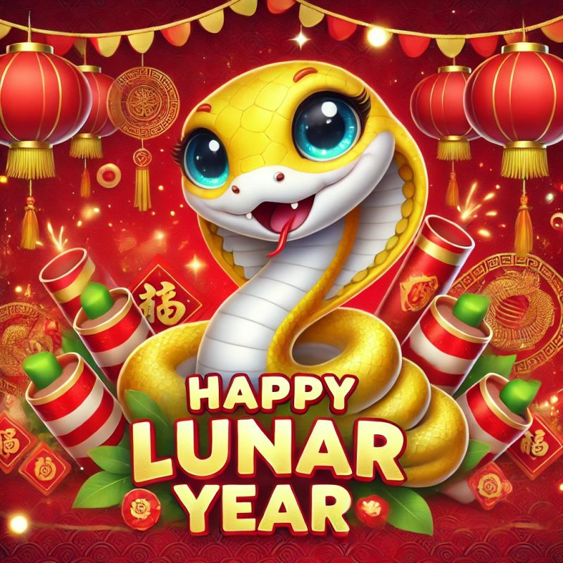
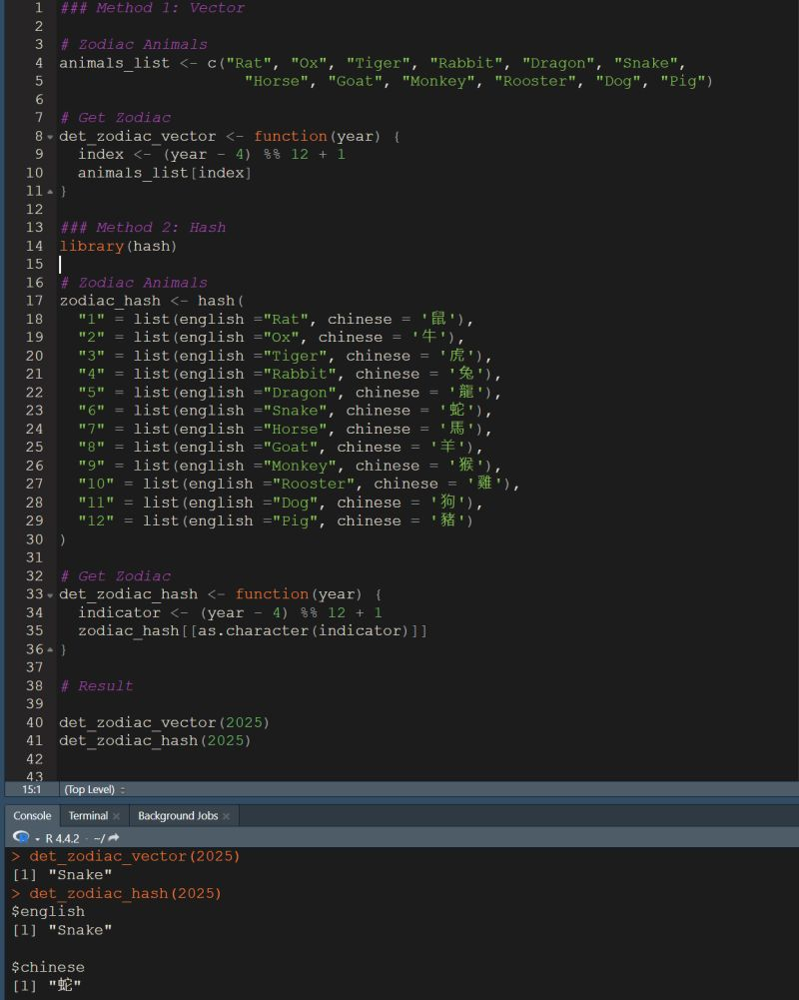

{style="border-radius: 10px;" width="400"}

The Lunar New Year holiday has begun — **Happy Year of the Snake!** 🎉🐍🎉\
In many Eastern cultures, the zodiac (生肖) plays an important role in tradition, storytelling, and even personal identity. This 12-year cycle assigns an animal to each year, with the animal of your birth year becoming your zodiac sign. For example, those born in 1989 or 2001 are Snakes 🐍, while others may be Tigers 🐅 or Rabbits 🐇.

But how exactly can we figure out someone’s zodiac animal using code?

Sure, you could just Google it… 😂\
But as an R programmer, I decided to use this as a small coding challenge!

## 🔍 The Idea

We’ll base our logic on the **Common Era (CE)** calendar, and apply a combination of **vectors** and the `{hash}` package in R to map a given year to its corresponding zodiac animal.

> 💡 *Note:* For more precise results, especially if you're working with historical or cultural data, you might want to factor in the **lunar calendar** (which usually starts in late January or early February). For this example, we’ll keep things simple.

## 🧮 How the Chinese Zodiac Works

The 12 animals, in order, are:

1.  Rat\
2.  Ox\
3.  Tiger\
4.  Rabbit\
5.  Dragon\
6.  Snake\
7.  Horse\
8.  Goat\
9.  Monkey\
10. Rooster\
11. Dog\
12. Pig

The cycle repeats every 12 years. For instance, the year 2025 will be the **Year of the Snake**, just like 2013, 2001, 1989, etc.

{style="border-radius: 10px;" width="400"}

## 💻 Coding It in R

Let’s write a simple function using the `{hash}` package:

\# Load the hash package library(hash)

# Define zodiac animals in order

zodiac \<- c("Rat", "Ox", "Tiger", "Rabbit", "Dragon", "Snake", "Horse", "Goat", "Monkey", "Rooster", "Dog", "Pig")

# Create a hash map for quick lookup

zodiac_hash \<- hash() for (i in 0:11) { zodiac_hash\[\[as.character(i)\]\] \<- zodiac\[i + 1\] }

# Function to get zodiac by year

get_zodiac \<- function(year) { index \<- (year - 4) %% 12 \# The cycle starts from year 4 AD as the Year of the Rat return(zodiac_hash\[\[as.character(index)\]\]) }

# Example usage

get_zodiac(2025) \# "Snake" You can now call get_zodiac(1985) or any other year to instantly find the associated animal.

🧠 Why Use {hash}? You could also solve this with a simple vector index, but using {hash} helps demonstrate how mapping structures work in R — it’s clean, fast, and especially useful when keys aren’t strictly numeric or sequential.

🐾 Final Thoughts While this example is a light-hearted way to blend culture with code, it also highlights how small projects like this can be both fun and educational. Whether you're celebrating the Lunar New Year or just exploring R, this is a great way to practice using vectors, modulo operations, and hash maps.

Wishing you a year full of clarity, joy, and good code. Happy Year of the Snake! 🐍💻✨
