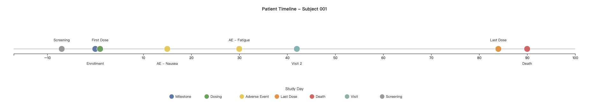

{style="border-radius: 10px;" width="800"}

---

## Why This Matters

In clinical data review, reviewers often need to switch between 
multiple reports to piece together one patient's story. A timeline 
view solves this by putting everything in one place — clearly and 
interactively.

---

## What's Next

This is an early draft. The next steps include:

- Adding **tooltip** interactions
- Building a **population-level view** for cross-patient comparison
- Adding **filtering and zoom** functionality

If you are also thinking about clinical data visualization, 
I would love to connect and exchange ideas!

