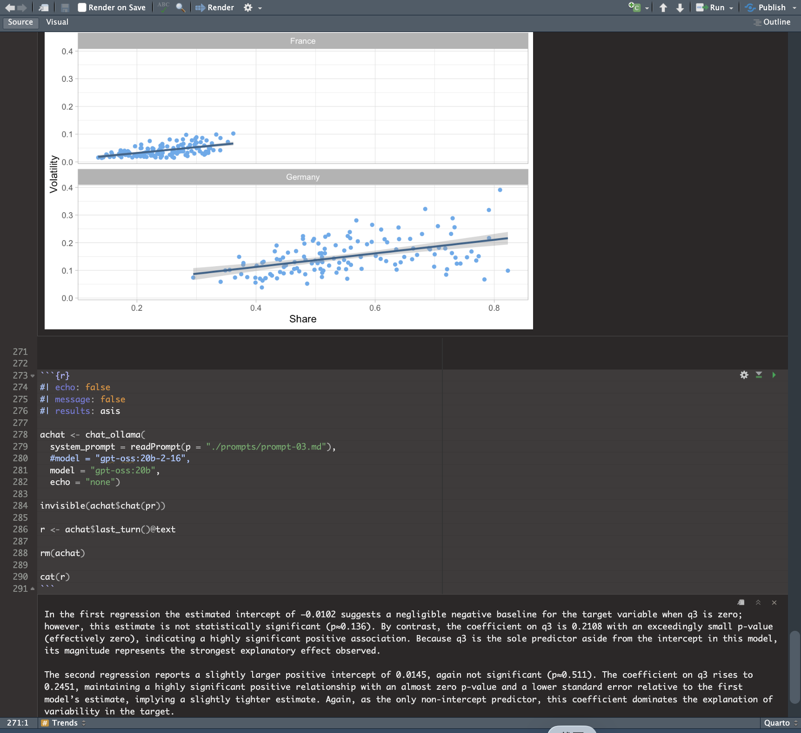

{style="border-radius: 30px;" width="500"}

📌 *This article is based on my notes from MIchał Ramsza's (SGH Warsaw School of Economics) tutorial "Quarto and AI for reproducible reports" at useR! 2026. All credit for the original materials and code goes to the presenter. The second half of this article describes what happened when I rebuilt the demo myself.*

------------------------------------------------------------------------

## Why This Workshop Stood Out to Me

The tutorial "Quarto and AI for reproducible reports" combines Quarto, LLMs, and R. Two things in it matter a lot to me: **reproducibility** and **whether we can trust AI to write narrative text**.

In the world of clinical trial reporting, these are not just academic questions. A TLF (table, listing, or figure) must produce the exact same result every time it is re-run. The narrative text in a CSR must match the numbers in the tables. Most demos about "LLMs that write reports" stop at "this looks impressive." Very few are honest about where the line sits between "this can be automated" and "this cannot." This workshop drew that line clearly, and it taught me a lot.

## Not Just a Demo, But Four Layers Built on Top of Each Other

The workshop moves step by step, from simple to complex. It can be split into four layers.

### 1. Quarto — A Publishing System

Quarto is a technical publishing system built by Posit on top of Pandoc. In short, it is "Markdown that can run executable code." A Quarto document has a YAML header (for metadata and output settings), followed by Markdown text and code chunks. Code chunks run in order and share the same environment. The command `` lets you combine several files together before the code runs. Setting `embed-resources: true` produces a single, self-contained HTML file that is easy to share. At the chunk level, you can use `#|` options to control the output in detail (`eval`, `echo`, `include`, `warning`). Tables are usually converted with `knitr::kable`, and Word output uses the `flextable` package.

The workshop also spent time on workflows used by companies: combining several documents dynamically with `knitr::knit_child`, and using a `reference.docx` template to produce Word documents in a fixed, compliant format. Custom styles are defined in the template first, then called by name inside Quarto. For anyone who works with regulatory documents, this feels familiar — you standardize everything into Markdown first, then apply a template to render it back into Word.

### 2. ellmer — The Bridge Between R and LLMs

The second layer is the `ellmer` package from Posit (version 0.4.1 in this workshop). The core idea is a **chat object**. It is built using the R6 class and manages the conversation between R and the LLM platform.

One technical detail worth remembering: the LLM API itself is stateless. What we call "conversation memory" is really the chat object repackaging the whole conversation history on your own machine and resending it with every new question. This is also why ending a conversation is as simple as running `rm()` on the object.

ellmer's design happens to use all three of R's object systems, each for a different job. Ordinary R objects (such as data.frame or lm) use S3, where a label tells a generic function how to behave. The chat object needs its conversation history to build up in place, without being copied, so it uses R6, which has **reference semantics**. Each turn in the conversation has a fixed structure and only holds data, so it uses the stricter S7 system, where you access values with `@` instead of `$`. Looking at all three side by side actually makes each one easier to understand than studying it alone:

| | S3 | R6 | S7 |
|---|---|---|---|
| Analogy | A labeled envelope | A vending machine | A form with fixed fields |
| How you access it | Generic functions (`summary(x)`) | `$method()` | `@property` |
| When you change it | A new object is created | It changes itself (reference semantics) | A new object is created |
| Best suited for | General data analysis | Things with state (connections, conversations) | Strict, well-defined data structures |

In simple terms: S3 is like a labeled envelope — a generic function reads the label and decides how to open it. R6 is like a vending machine — you press a button, something changes inside, but it is always the same machine; it is never copied. S7 is like a form with fixed fields — every field must be declared in advance, with a defined type, and it only stores data, with no methods attached. ellmer chose R6 for the chat object and S7 for each turn, which matches whether or not each type of object should ever be copied.

### 3. Tool Calling — Keeping Hallucination in a Cage

The third layer is the real technical core of this workshop: **tool calling**. The idea is to register an R function — for example, `getFiles()`, which lists files in a directory — as a tool the LLM can call. When the LLM needs real-time information, it triggers the tool, and the result is sent back to the model as new context.

```r
### The tool itself: an R function with a built-in safety check
getFiles <- function(path = "./", patt = ".*") {
  ## Safety check: arguments sent back by the LLM through JSON are
  ## often parsed as a list rather than a plain string, so unwrap them first
  if (typeof(path) == "list") path = first(path)
  if (typeof(patt) == "list") patt = first(patt)
  ## Call the real function
  list.files(path = path, pattern = patt)
}

### Wrap it into a tool the LLM can use
getFiles_tool <- tool(
  fun = getFiles,
  description = "This tool accepts two arguments. Every argument is a
    string. It is not a list of strings, but a simple string. The tool
    returns a vector of strings containing the names of all files in a
    given directory that match a specified regular expression.",
  arguments = list(
    path = type_string("A string that gives a path to the directory...",
                        required = FALSE),
    patt = type_string("A string that gives a regular expression...",
                        required = FALSE)
  ),
  name = "getFiles",
  convert = TRUE
)
```

There is a small but important double safeguard hidden in this code. Inside `getFiles()`, a safety check unwraps any argument that might have been parsed as a list, forcing it back into a plain string. At the same time, the `description` inside `tool()` explicitly states that "arguments must be plain strings, not a list of strings." In other words, the constraint is set twice: once at the natural-language level (telling the LLM how to send arguments) and once at the code level (protecting the function in case the LLM does not follow the rule). This "prompt-level constraint plus code-level defense" pattern is, for me, one of the most useful details in this whole example.

```r
### Create the chat object, register the tool, and watch each call
achat <- chat_ollama(
  model = "gpt-oss:20b",
  system_prompt = "You are a helpful assistant and you follow orders.",
  echo = "none"
)

achat$register_tool(tool = getFiles_tool)

achat$on_tool_request(function(request) {
  print(paste("Tool called:", request@name))
  print(request@arguments)
})

### A sample of the step-by-step test questions
achat$chat("Give me a list of all files in my current working directory.")
achat$chat("Give me a list of all files in the subdirectory figs
            of my current working directory. I only want the PNG files.")
```

The full test script prepares seven questions, moving step by step from "list all files" to "give me files whose name contains a certain substring." One question deliberately asks for a file type that almost certainly does not exist, to see whether the model will honestly say "there are none" instead of making something up. This is exactly where the value of this mechanism lies: the LLM is not answering from memory. It is forced to read real data that you can verify, because you control execution from start to finish — the LLM only ever has the right to "ask."

### 4. Quarto + LLM — A Complete Demo That Ties the Three Layers Together

The final layer brings the first three together into one complete `main.qmd` file: a report on the share of renewable electricity generation across different countries. R does all the work of reading data, cleaning it, running regressions, and making plots. The LLM only steps in at three points — writing the introduction, describing the data table, and summarizing trends across countries — and each of these three calls reads its instructions from a separate external prompt file, keeping the `.qmd` file itself clean.

All three LLM calls follow exactly the same code structure: the chunk sets `echo: false`, `eval: true`, and `results: asis` together (all three are required, so the output is inserted as raw Markdown instead of being shown as a code block). Then the code creates a chat object, wraps the call in `invisible()`, extracts `last_turn()@text`, deletes the object with `rm()`, and writes the text into the document with `cat()`.

````r
#| echo: false
#| eval: true
#| results: asis

achat <- chat_ollama(
  model = "gpt-oss:20b",
  system_prompt = readPrompt("./prompts/prompt-01.md"),
  echo = "none"
)

invisible(achat$chat("Write the introduction on energy generation."))

r <- achat$last_turn()@text

rm(achat)

cat(r)
````

The Trends section is especially well designed. Four plots build up in complexity, one step at a time: a simple time-series line plot, a monthly ribbon plot showing the 25th, 50th, and 75th percentiles, a time series of IQR (interquartile range) used as a measure of "volatility," and finally a scatter plot of volatility against the level of renewable share. On top of this, **a separate regression is run for each country** to test the hypothesis that "a higher share of installed renewable capacity is linked to higher volatility on the consumption side." Each country's regression result is converted into a Markdown table with `broom::tidy()`, and all of these tables are joined together — this combined text is the actual input for the final LLM call.

```r
### Run a separate regression for each country, and turn the results
### into Markdown tables
cs <- tab3 |> distinct(Country) |> pull(Country)

models <- lapply(X = cs, FUN = function(cc) {
  tab3 |>
    filter(Country == cc) |>
    lm(IQR ~ + 1 + q3, data = _) |>
    broom::tidy() |>
    kable(format = "pipe") |>
    paste(collapse = "\n")
})

### Join all countries' regression tables into one block of text,
### which becomes the input for the final LLM call
pr <- r"(
These are all the linear regression models for many countries.
Write a summary of these results in a concise way.
)" %G% paste(unlist(models), collapse = "\n\n\n")

achat <- chat_ollama(
  system_prompt = readPrompt(p = "./prompts/prompt-03.md"),
  model = "gpt-oss:20b",
  echo = "none")

invisible(achat$chat(pr))
r <- achat$last_turn()@text
rm(achat)
cat(r)
```

The same division-of-labor logic shows up in another example too: an automated extraction pipeline for base prospectus documents in finance. It has four functions across five steps — reading a PDF's technical metadata (without using an LLM at all), detecting the document's language, translating it if needed, and finally using a JSON schema to extract five structured fields such as issuer, product type, and offering amount. Each step handles one narrow task, instead of asking an LLM to "summarize this whole document" in one shot.

## Where I Think the Real Value Lies

Neither Quarto nor ellmer is a new invention, and this workshop never claimed to invent anything. What is worth remembering is the dividing line it draws: **tables, numbers, and plots are anchors, produced by R, verifiable, and reproducible; the LLM's only job is to translate these anchors into natural language.** Where you draw that line decides whether this kind of technology can enter a regulated environment.

This connects to a question I think about often: **end-to-end traceability**, from raw data all the way to the final report, is still a real challenge in both the SAS and R worlds. This workshop demonstrated one workable, partial answer — using tool calling to keep the LLM's freedom limited to data you can control.

## After Rebuilding the Demo Myself

Reading notes alone does not tell you how "ready to run" a demo really is. I rebuilt the base-prospectus pipeline from the tutorial myself, and just setting up the environment took real effort: the folder structure on my machine did not exactly match the one shown in the materials, R's working directory did not default to my project folder, and Ollama was not actually installed on the system path at first. These are all details the materials cover with a single line — "adjust the paths" — but you only run into them once you actually try.

Once the environment worked, I reached the structured-extraction step, and the model named in the materials was not on my machine. I temporarily swapped in another model I already had, just to get all five steps running end to end. After that, I reran the same extraction on the same document using a third model, purely to check how stable the results were. Four of the five fields matched exactly. Only one field differed between the two models: one correctly identified the security type in the document as "Notes," while the other mistakenly placed a legal abbreviation from the issuer's name into the field meant for the security type.

This finding reminded me of the dividing line the workshop kept coming back to. Grounding — feeding the LLM real text alongside a clear schema — guarantees that "the model is looking at real material." It does not guarantee that "the model's interpretation of that material is correct." Four matching fields give you confidence; one mismatched field is exactly the kind of flag that says "this needs human review." This was not a technique the materials set out to teach — I stumbled onto it myself while debugging. But it captures the spirit of the whole workshop rather precisely: what can be automated is "turning data into language." What cannot be automated is "making sure the language stays faithful to the data." That check, in the end, still has to be done by a person.

Here is a comparison of what the two models extracted from the same document:

| Field | gpt-oss:20b (13 GB) | gemma3:12b (8.1 GB) | Match? |
|---|---|---|---|
| issuer | SIA Mintos Finance No. 45 | SIA Mintos Finance No. 45 | ✅ Match |
| offering_amount | €10,000,000 | up to EUR 10 000 000 (ten million euro) | Same content, different format |
| product_type | limited liability company | Notes | ⚠️ Mismatch |
| program_name | EUR 10 000 000 Note Programme | EUR 10 000 000 Note Programme | ✅ Match |
| regulatory_status | More detailed version | Shorter version | Same content, different detail |

Interestingly, the smaller model, `gemma3:12b`, got the one mismatched field right. This supports the same conclusion: a larger model size does not automatically mean higher reliability. What you can actually rely on is whether there is still a human checkpoint in the process.

## Takeaways After This Workshop

1. **A safety boundary for AI adoption that can go straight into an SOP.** Numbers come from R, narrative comes from the LLM — this division of labor turns "where AI is and isn't allowed" into a rule that can be audited and formalized, rather than a vague question of trust. It is the kind of adoption model that regulatory and information-security teams can actually approve.
2. **Keeping control of the data is what convinces QA and regulatory teams.** Tool calling means the LLM can only read data sources that the organization has specified and verified, instead of generating answers from memory. This means adopting AI does not require giving up data governance or the audit trail — it is an architecture that can pass an internal risk assessment, not a black box.
3. **Understanding the underlying architecture matters for data security and vendor decisions.** The idea that "AI remembers our conversation" is really a history managed on the client side, resent in full with every new question. Organizations need to know exactly what data leaves the building with every single call — this is a compliance question that cannot be avoided when evaluating cloud versus on-premise deployment, or choosing an AI vendor.
4. **Cross-checking multiple models is a way to speed up QC, not to replace people.** Running the same document through different models and comparing the results can catch potential errors before human review, speeding up the review process. But the final decision and sign-off must still rest with a qualified professional — this is a practical way to balance efficiency with regulatory requirements.
