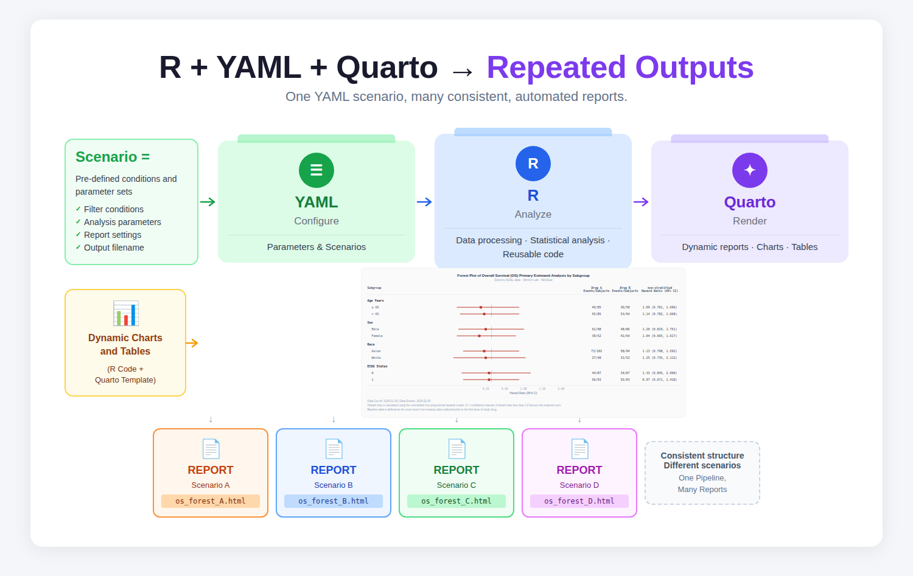
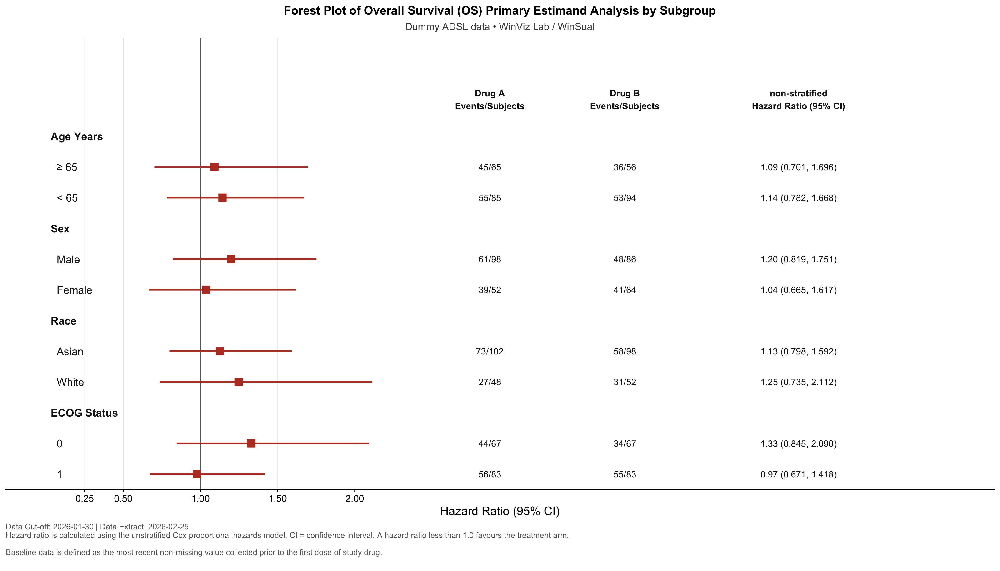
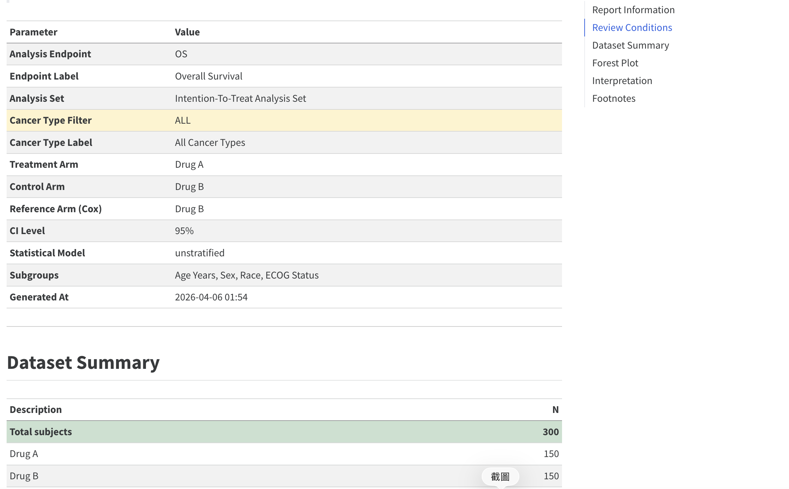
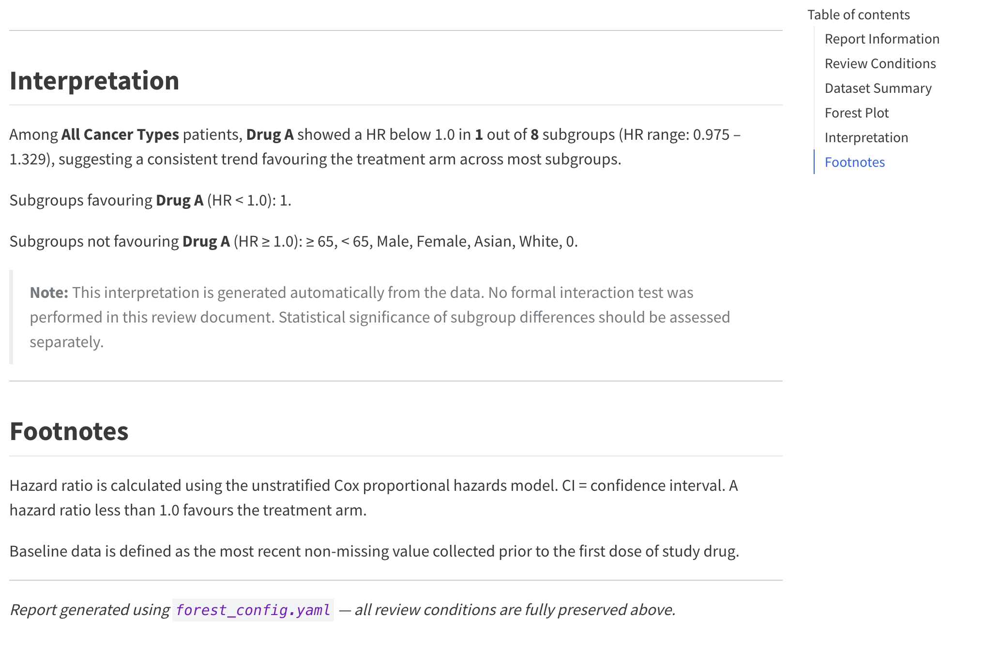
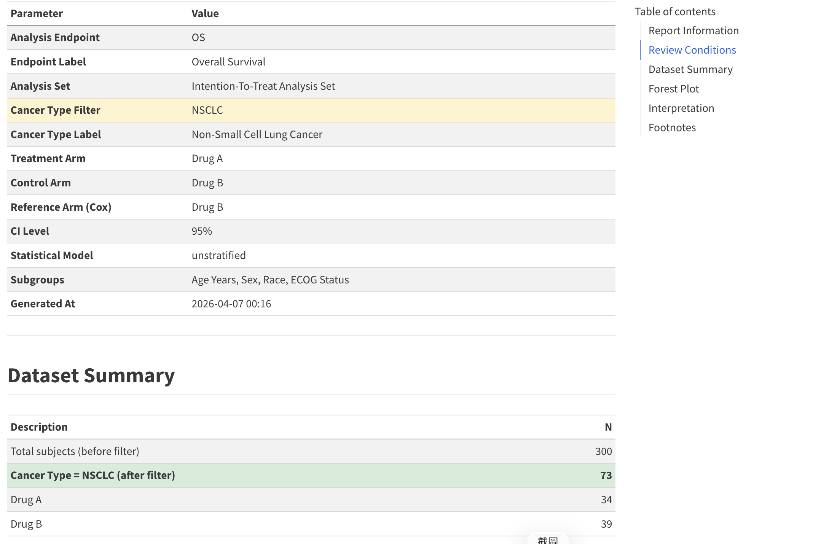
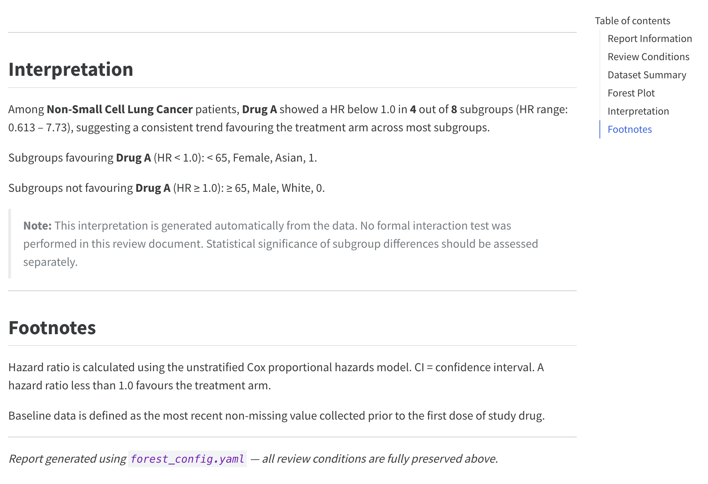

{style="border-radius: 10px;" width="60%"}

R + YAML + Quarto = Core analysis structure + Flexible parameter control + Integrated summary reporting.

When you need to produce outputs with the same structure but different filter conditions — what I call **repeated outputs** — how do you handle it? Both SAS Macro and R functions are efficient approaches.

But what if each of these repeated outputs also needs its own written summary report? What if the outputs require further filtering, or the person running them is not familiar with coding?

R + YAML + Quarto is one possible solution. This post uses a **Forest Plot** as an example to walk through the full workflow.

---

## What is a Forest Plot in clinical trials?

A Forest Plot is commonly used to present subgroup analysis results for a specific endpoint. It helps research teams explore statistical outcomes across different patient groups, and can even inform the planning of sub-studies.

{style="border-radius: 10px;" width="60%"}

In this example, the plot shows the number of Overall Survival events and Hazard Ratios for Drug A versus Drug B across multiple subgroups. The dummy dataset includes three cancer types: HCC, CRC, and NSCLC.

---

## The role of each tool

### R: Core analysis structure

R handles all statistical computing and plot generation. The script reads parameters from the YAML file, fits an unstratified Cox proportional hazards model for each subgroup, calculates HR and 95% CI, produces the plot, and saves the results as an RDS file for Quarto to use. Any changes to analysis logic, plot style, or output format are managed here.

### YAML: Flexible parameter control

The YAML file is the only place you need to edit. Switching cancer type filters (HCC / CRC / NSCLC / ALL), changing the analysis endpoint (OS / PFS), updating treatment arm names, or adjusting subgroup definitions — all of this is done by editing the YAML, without touching the R script. This design means that even reviewers who are not familiar with coding can adjust parameters on their own.

### Quarto: Integrated summary reporting

Quarto combines the R output with written content into a complete HTML report. Each time you render, Quarto automatically runs the R script, reads the latest results, and produces a report that includes a review conditions snapshot, dataset summary, Forest Plot, and an auto-generated interpretation paragraph. The YAML parameters are fully preserved in the report, creating a natural audit trail without any extra effort.

---

## Full workflow summary

```
Edit forest_config.yaml          
        │
        ▼
quarto render forest_report.qmd
        │
        ├── Automatically runs forest_template.R
        │     ├── Reads YAML parameters
        │     ├── Filters data by cancer type
        │     ├── Calculates HR and 95% CI per subgroup
        │     └── Exports PNG + RTF + RDS
        │
        └── Reads RDS, builds HTML report
              ├── Review conditions snapshot
              ├── Dataset summary
              ├── Forest Plot
              └── Auto-generated interpretation
```

The core value of this workflow is simple: **every report is a decision snapshot**. The review conditions, analysis results, and generation time are all preserved. Anyone can reproduce the exact same output using the same YAML file, at any point in time.

---

## Example: All cancer types

The default output covers all cancer types. The report includes a dataset summary and Forest Plot with subgroup results across Age, Sex, Race, and ECOG Status.

{style="border-radius: 10px;" width="60%"}
{style="border-radius: 10px;" width="60%"}

---

## Example: Switching to NSCLC

To view results for a specific cancer type — such as NSCLC — you only need to update the `cancer_filter` section in the YAML file. No code changes are required. After rendering, the statistical results and written summary are automatically regenerated with the same structure.

```yaml
cancer_filter:
  selected: "NSCLC"
  label:    "Non-Small Cell Lung Cancer"
```

{style="border-radius: 10px;" width="60%"}
{style="border-radius: 10px;" width="60%"}

---

The full template — including `forest_template.R`, `forest_config.yaml`, and `forest_report.qmd` — is available on [WinViz Lab](https://winklelu.github.io/WinSual/winviz.html).
