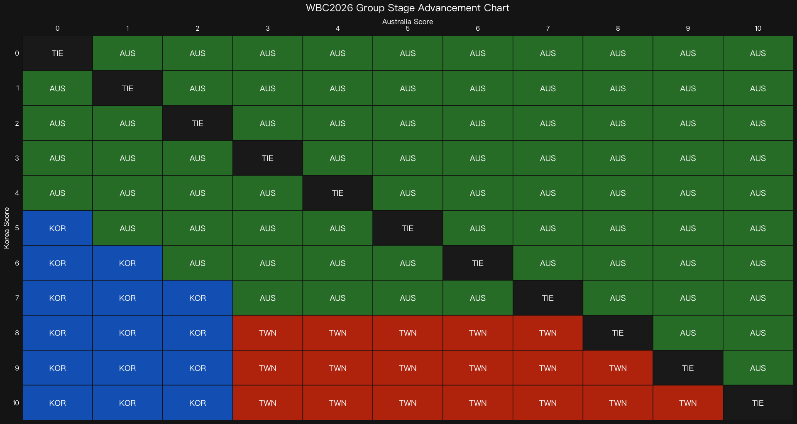

{style="border-radius: 10px;" width="800"}

---


The **World Baseball Classic 2026** has been the hottest topic in Taiwan these past few days. Whenever Taiwan plays, the whole country is glued to the screen.

Taiwan, Japan, Korea, Czech Republic, and Australia are in the same group. The top 2 teams by wins advance to the Super Round in the US. If teams are tied on wins, the tiebreaker goes to runs allowed in head-to-head matchups — a rule that is honestly hard to explain and even harder to calculate on the fly.

Taiwan ended up in exactly that situation:

- Taiwan vs Australia: **0–3**
- Taiwan vs Korea: **5–4**

So when Korea faced Australia, one chart became the most-shared image among Taiwan fans — a matrix showing every possible score combination and who advances.

I rebuilt it in R using `ggplot2`.

---

## The Chart

The X-axis is Australia's score. The Y-axis is Korea's score. Every cell tells you directly: does **Taiwan**, **Korea**, or **Australia** advance?

```{r}
#| label: wbc-chart
#| fig-width: 9
#| fig-height: 8
#| fig-align: center

library(ggplot2)
library(tidyverse)

df <- expand.grid(korea = 0:10, australia = 0:10)
df <- df %>% mutate(
  result = case_when(
    korea == australia              ~ "TIE",
    australia > korea               ~ "AUS",
    korea >= 8 & australia >= 3     ~ "TWN",
    korea - australia <= 4          ~ "AUS",
    korea > australia & korea <= 7  ~ "KOR",
    TRUE                            ~ "KOR"
  )
)

color_map <- c("AUS" = "#2E7D32", "KOR" = "#1565C0", "TWN" = "#BF360C", "TIE" = "#212121")

ggplot(df, aes(x = australia, y = korea, fill = result)) +
  geom_tile(color = "#111111", linewidth = 0.5) +
  geom_text(aes(label = result), color = "white", size = 5, fontface = "bold") +
  scale_fill_manual(values = color_map) +
  scale_x_continuous(breaks = 0:10, position = "top", expand = c(0, 0)) +
  scale_y_reverse(breaks = 0:10, expand = c(0, 0)) +
  labs(
    title = "WBC2026 Group Stage Advancement Chart",
    x = "Australia Score",
    y = "Korea Score"
  ) +
  theme_minimal(base_size = 14) +
  theme(
    plot.background  = element_rect(fill = "#1a1a1a", color = NA),
    panel.background = element_rect(fill = "#1a1a1a", color = NA),
    panel.grid       = element_blank(),
    plot.title  = element_text(color = "white", hjust = 0.5, size = 18, face = "bold"),
    axis.text   = element_text(color = "white", size = 12, face = "bold"),
    axis.title  = element_text(color = "white", size = 13),
    axis.ticks  = element_blank(),
    legend.position = "none"
  )
```

---

## Design Decisions Worth Noting

Three `scale_*` functions do most of the heavy lifting here.

**`scale_y_reverse()`** flips the Y-axis so that 0–0 sits at the top-left corner. This matches how humans naturally read a table — from the starting point outward. Without it, low scores would appear at the bottom, which feels backwards for a lookup chart.

**`scale_fill_manual()`** assigns each country a fixed color. The color carries meaning on its own. No legend needed — the reader understands immediately.

**`scale_x_continuous(position = "top")`** moves the X-axis label to the top of the chart. Combined with the reversed Y-axis, the whole chart becomes a lookup table rather than just a plot.

---

## The Bigger Idea

Good data visualization removes the need to think.

---

## The Final Result

Korea finished 2nd. They advanced alongside Japan.

Taiwan's journey ended there — but the chart lived on. ⚾

---


