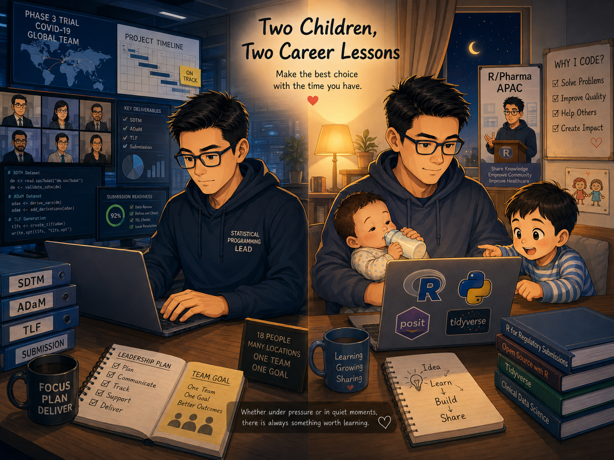

{style="margin-bottom: 1em; border-radius: 8px;" width="478"}
------------------------------------------------------------------------

## Two Children, Two Career Lessons

In the three months after my first child was born, I was part of a project that mattered to the whole company. I learned how to lead an 18-person team, spread across many locations, and bring them safely to the finish line under extreme pressure.

After my second child was born, something different happened. The three-to-six-hour gap between night feedings became the start of a new learning habit. This lesson was different. It taught me that growth does not always come from pressure. Sometimes, it comes from a choice you make on your own.

These two stories look very different. But they are both about the same thing: making the best choice you can, with the time you have.

## The Three Months After My First Child Was Born

Three months after my first child was born, I joined the most important project in the whole company — a COVID-19 Phase 3 trial. Our goal was to finish the work as fast as possible and submit it for publication.

I was the Programming Lead. My team had 18 people, and they worked from many different locations — nobody was in the same office. Our work covered everything from SDTM and ADaM to TLFs and the final submission documents. For 40 days in a row, I joined a progress meeting with the CEO and department heads every night. Every week, I prepared summary datasets and Excel reports for the medical team. On top of that, urgent statistical requests could come in at any time.

In three months, we completed the full Phase 3 process, from raw data to submission — and successfully published the paper in NEJM. During that time, I worked more than 16 hours a day for 45 days straight.

### My Job Was More Than Just Writing Code

My real role was closer to being the person who kept the whole programming team moving. I planned the timeline, kept our documents up to date, tracked every task, checked in with each role on the team, and stepped in whenever something urgent came up.

### Four Real Challenges — and How I Handled Them

**A tight timeline.** Working within our department's existing process and tools, I built a clear, well-estimated timeline. I also sent frequent status updates and summary emails. I didn't wait for problems to appear — I tried to show the real situation early, before it became a crisis.

**Too many requests from other departments.** I learned to ask one question first: how urgent is this? If it was truly urgent, I assigned the right person right away. If it wasn't, it waited until the team had time. This sounds simple, but making that call clearly, in the middle of chaos, is a real skill.

**Keeping track of progress.** Besides using a tracker file, I put everyone working on related tasks into the same chat group. This wasn't about control — it was about letting information move freely, so everyone could see where others were stuck.

**The department's first real submission.** At the time, our department had many tools, but had never actually gone through a full, formal submission. This meant we faced more than just a tight schedule — we also had to adjust our tools and help the team adapt. I had submission experience from before, so I worked closely with the right people on the core tasks, wrote out every step clearly for them, and ran a formal training session on the tools. In the end, we delivered everything the submission needed.

### What Mattered More Than the Result

Three months, one full project delivered end to end, one paper published in NEJM — these are the visible results. But a few deeper lessons still stay with me:

First, when family care and work both reach their limits at the same time, paying for extra childcare support is not giving up. It's a real way to protect the other people caring for your child from burning out.

Second, I later realized that a large part of those 16-hour days went into cross-department communication, document upkeep, handling SAP changes, and last-minute tasks — not the core logic work itself. If I had built a small core team of one or two people to share this management work, the whole team would have had more room to focus on the tasks that truly needed deep thinking, instead of being interrupted by small coordination issues all day.

Third, with a team of 18 people, simply multiplying "total headcount" by "hours" misses something important: the value of adding more people drops as the team grows. A better approach might be to build different team combinations for different project stages — one group focused only on core logic, and another group handling urgent requests and cross-department support. Work should be divided by the nature of the task, not just by stacking more people on the clock.

Fourth, testing a tool only counts when you run it through the entire workflow, start to finish. Testing each function on its own can look complete, but different stages can affect each other. Problems can still show up later and need fixing again. Real validation means running the tool through the whole process — not just checking each function by itself.

## A Few Years Later, Our Second Child Was Born

This time, the company no longer needed frequent overtime. The pace of work was different — but a new kind of challenge showed up in daily life instead.

In the newborn stage, babies need to be fed every three to four hours. At first, I used the breaks to watch Korean dramas on Netflix. But after a while, I couldn't find any show or movie that really interested me anymore. Then one day, while scrolling through LinkedIn, I saw a few global pharma companies sharing how they used R for regulatory submissions. That was the moment my interest was truly sparked. I decided to pick up my R and Python skills again, seriously this time.

### Feeding Time Became Study Time

Each feeding gave me a solid block of three to six uninterrupted hours. R wasn't new to me — I had used it for my master's thesis, so I wasn't starting from zero. I already had some basic concepts to build on.

I started by watching many talks and case studies about using R for submissions. I focused on a few clear questions: What problems did people run into? What did the overall workflow look like? What tools did they use most often? And which of these could I actually apply in my own daily work? These questions helped me stay focused, instead of just browsing without direction.

From there, I used resources shared by Posit, real experiences shared by other LinkedIn users, and some well-known tutorials. Slowly, I combined all of this with my own clinical trial experience, and started building small tools of my own — and sharing them, too.

### One Brave Application Opened a New World

After some time, I saw the call for speakers for R/Pharma APAC. I thought about it, then took a chance and submitted my first-ever talk that wasn't about SAS. I was lucky — the talk was accepted.

During preparation, I worked with a mentor. From building the slides, to shaping the content, to actually standing on stage, I learned so much from people with very different backgrounds. It was a great experience. After that, I kept submitting talks to different conferences, and I also shared these experiences internally at my company a few times.

### From Learning Alone to Learning With a Community

From studying alone during feeding breaks, to joining the open-source community and speaking at conferences, I met many talented people along the way. Through these conversations, I picked up ideas I had never been exposed to before.

Because of this experience, I started to see the role of "Statistical Programmer" in a whole new way. This path can be interesting, varied, and full of room for you to shape your own future.

## Two Lessons, One Shared Idea

Whether I was pushed forward by pressure during those three months, or chose to study on my own late at night, both experiences taught me the same thing: you can always find something worth learning, whether you're under high pressure or working in a quiet gap of time.

The difference is this. Sometimes, learning is a choice you make when you have some space. Other times, it's a responsibility — using the skills you already have to protect the quality of the whole process. Neither one is more valuable than the other. They are simply two sides of a career, and they take turns showing up at different stages of your journey.
