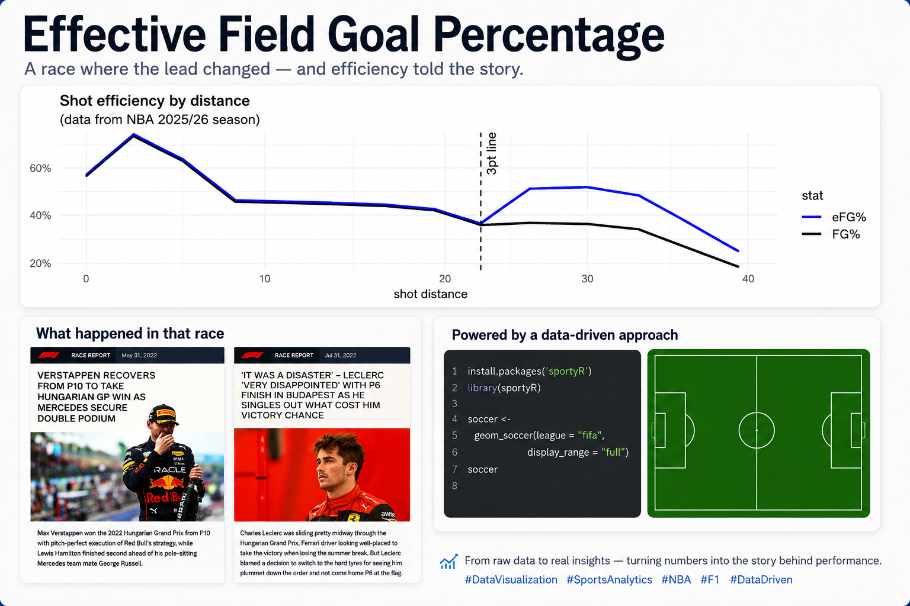

{style="border-radius: 20px;" width="70%"}

👉 **Question for you:** *If you could analyze data from any sport, which one would you pick — and what question would you ask?*

> 📌 *This post is based on my notes and reflections from Max Marchi's session "Analyzing Sports Data with R" at the useR! 2026 conference. All credit for the examples and analysis framework goes to the original speaker.*

---

## A Dream Topic, Face to Face

R for sports analytics — my dream topic, and my first chance to learn it face to face! Thank you, Max Marchi, for "Analyzing Sports Data with R".

At the useR! conference, I can explore how R is used in different fields and what problems people are working on. When I first entered data analysis, sports science was one of my dream areas. Maybe because I love the NBA — and I always wondered how a sport with so many variables could use data to understand athletes, build defensive strategies against other teams, and shape a team's own blueprint.

To me, sports analytics felt both dreamy and mysterious!

Fun fact: Max Marchi is not just a speaker on this topic — he works as an Analyst in Baseball Research & Development for the Cleveland Guardians (MLB), and co-authored the book *Analyzing Baseball Data with R*. This session was sports analytics from someone who does it for a living.

---

## One Workflow, Two Sports

Max Marchi's "Analyzing Sports Data with R" was the session I locked in from the start. With two popular sports, he demonstrated the complete data analysis workflow:

**data collection → cleaning → visualization → modeling → strategy analysis**

### 🏀 Basketball: Why the Mid-Range Shot Disappeared

Max opened with how NBA shooting culture has changed. Sitting in the audience, I was so excited: so THAT's the principle behind it!

- Using 25 years of NBA box score data, the ratio of three-point to two-point attempts shows a dramatic shift — in 1993 the three-point attempt rate was still 3%, the same as in 1979 when the line was introduced. Today the story is completely different.
- Play-by-play data with shot coordinates (x, y) makes the change visible: comparing 30,000 shots each from the 2022 and 2025 seasons, the 2025 shots cluster near the rim and beyond the arc (especially the corners), while mid-range attempts have almost vanished.
- The explanation is **eFG% (Effective Field Goal Percentage)**, introduced by Dean Oliver in *Basketball on Paper* (2004):

  **eFG% = (FGM + 0.5 × 3PM) / FGA**

  A three-pointer is worth 1.5 times a two-pointer, so eFG% weights it accordingly. Looking at raw field goal percentage, accuracy drops as distance increases. But when you convert to eFG%, shots from just beyond the three-point line out to about 32–33 feet actually have a higher expected value than mid-range shots between 9 feet and the arc. One simple weighted metric explains the tactical shift of the entire league.
- Bonus tool: the `sportyR` package draws sports playing surfaces (e.g., `geom_basketball("NBA")`) and integrates with `ggplot2` to overlay shot charts directly on the court.

### 🏎️ Formula 1: When to Pit?

The second example was F1 pit stop strategy analysis, using lap-by-lap data from the 2022 Hungarian Grand Prix pulled with the `f1dataR` package.

- **Cleaning first:** raw lap times are noisy. Removing pit-lane laps, safety car / yellow flag laps, and lap 1 (standing start) reveals two clear trends — cars get faster overall as fuel burns off, but within each stint lap times rise as tires degrade.
- **A simple linear model** with just three variables — lap number (a proxy for fuel load) and the interaction between tire compound and tire age — quantifies it: soft tires are fastest but degrade fastest; hard tires are slowest but most durable.
- **Strategy simulation:** a function takes pit stop laps, tire choices, race length (70 laps), and average pit loss (22 seconds), then outputs cumulative race time — showing that one-stop and two-stop strategies can end up remarkably close.
- Max was honest about the limits: "This was really a toy example... teams actually do things that are much more complicated." Real teams use non-linear models to predict tire collapse, fed by hundreds of telemetry sensors, weather, and traffic. In that very race, Verstappen won from P10 while Leclerc's race was compromised by a switch to hard tires — strategy decides outcomes.

---

## Three Key Takeaways

1️⃣ **Real-world data is almost always messy.** Cleaning it takes both strategy and patience — flipping shot coordinates to one half of the court, or excluding safety car laps, is where the real analysis begins.

2️⃣ **Data visualization should exist at every stage, not just in the results.** From defining the problem to observing and analyzing it, visualization is a key way to communicate.

3️⃣ **The similarity with clinical trials:** designing and understanding derived variables (like eFG%) is the core of data analysis — exactly the spirit of ADaM analysis variable design. A well-designed derived variable can explain more than a complex model.

---

