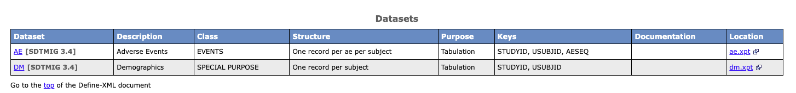
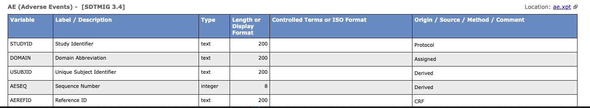

---

{style="border-radius: 10px;" width="800"}

For me, define.xml has always been both familiar and mysterious.

Familiar — because I started working with it in my second year in clinical trials, and have been involved in submission work ever since.

Mysterious — because I had never actually built one from scratch. In most CROs and pharmaceutical companies, define.xml is generated through company macros, Pinnacle 21, or a dedicated team. The structure was always there, but I had never taken it apart myself.

This time, I did.

---

## What is define.xml?

define.xml is a required submission document for most regulatory authorities.
It helps reviewers understand the content of clinical trial datasets.
It stores metadata in XML format and allows reviewers to check whether the data follows CDISC standards.

Most importantly — it turns metadata into a human-readable HTML page, showing dataset lists, variable descriptions, data sources, and controlled terminology.

> If helping people see data more clearly is data visualization,
> then Define-XML is the most important visualization tool for clinical trial data.

---

## XML as a Puzzle

Before writing any code, I had to understand the basic structure of XML.

There are two things in XML that are often confused:

**Element** — a container with an opening and closing tag, which can be nested inside other elements:

```xml
<ItemDef>
  <Description>
  </Description>
</ItemDef>
```

**Attribute** — a description written inside the opening tag:

```xml
<ItemDef
  OID      = "IT.AE.AETERM"
  DataType = "text"
  Length   = "200">
```

An Element is a container. An Attribute is a label on that container.

Once this distinction is clear, the full Define-XML structure becomes readable:

```
<ODM>                    ← Root of the document, declares namespace
  <Study>                ← Study identification
    <MetaDataVersion>    ← Container for all definitions
      <def:Standards>    ← Declares SDTMIG version
      <ItemGroupDef>     ← Dataset level (AE / DM)
        <ItemRef>        ← List of variable references
        <def:Class>      ← EVENTS / FINDINGS...
        <def:leaf>       ← ★ XPT file location (must be inside here)
      <ItemDef>          ← Variable level (one per variable)
        <def:Origin>     ← CRF / Derived / Protocol
```

Each piece has a fixed position. Put it in the wrong place and something breaks.

I experienced this myself — I placed `def:leaf` outside of `ItemGroupDef`, and the result was `[unresolved: LF.AE]` in define.html. It took me a while to trace the problem back to **Section 6 — Global Element Ordering** in the CDISC Define-XML Specification.

That section is only one page long, but it shows the correct order of every element in the document. I think it should be placed at the beginning, not the end.

---

## What the R Program Does

The program works through three parts working together:

```
R list   → Storage: holds all metadata from XPT files
do loop  → Engine: takes out and processes each dataset and variable
xml2     → Output: writes data as XML nodes, builds the nested structure
```

**R list** stores all metadata after reading XPT files with `haven::read_xpt()`.
XPT files already contain metadata built in — each column carries a `label` and `width`.
Using `attr(col, "label")` gets this information directly, with no manual input needed.

**do loop** uses two nested loops to process each dataset and each variable one by one.
If AE has 30 variables, the loop runs 30 times and creates 30 `ItemDef` elements automatically.

**xml2** uses `xml_add_child()` to add a child node under an existing node
and fill in attribute values at the same time — creating an Element and its Attributes in one line.
For every level of nesting in the XML, there is one call to `xml_add_child()`.

---

## Results

Using AE and DM as examples, the program reads all XPT files from a `dataset/` folder,
automatically determines Domain Class, Key variables, and Origin,
and outputs both `define.xml` and `define.html`.

The full output looks like this in the browser:

- **Dataset overview**: shows AE / DM Class, Structure, Key Variables, and Location
{style="border-radius: 10px;" width="600"}

- **Variable list**: shows Label, DataType, Length, and Origin for each variable

{style="border-radius: 10px;" width="600"}

---

## A Practical Note

`define.xml` is mainly read by machines.
Some browsers — including Chrome — cannot open it directly by default.

It is a good idea to always generate `define.html` at the same time,
which is much easier for reviewers to open and read.

---

## Reflection

After 12 years as a statistical programmer,
this is the first time I truly understood what XML is about.

Not because I read the specification from page one,
but because I started from an error message — `[unresolved: LF.AE]` —
and followed it all the way to Section 6,
until the whole puzzle came together.

You only really remember something when you use it.

---

## The Full Program

> ⚠️ **Note**: This program is for demonstration purposes only.
> It does not include **CodeList**, **Value-Level Metadata**, or **MethodDef** —
> all of which are required for a complete regulatory submission.
> For production use, please refer to the
> [CDISC Define-XML v2.1 Specification](https://www.cdisc.org/standards/data-exchange/define-xml).

```r
# ============================================================
# Define-XML v2.1 Generator  (Revised Edition)
# Simultaneously generates define.xml AND define.html
#
# Key Fixes from Previous Version:
#   [1] def:leaf moved INSIDE ItemGroupDef (spec §4.2.1 / §5.3.11)
#       → Fixes "[unresolved: LF.XX]" in Location column
#   [2] def:ArchiveLocationID & def:StandardOID written as proper
#       XML attributes with correct namespace handling
#   [3] Standard version updated to SDTMIG 3.4
#   [4] def:DefineVersion corrected to "2.1.0" (full version string)
#   [5] MetaDataVersion attributes aligned with spec example
#
# Folder Structure (Mac):
#   ~/R/R_work/Practice/
#   ├── prog/       ← this script
#   ├── dataset/    ← put ALL xpt files here
#   └── output/     ← define.xml + define2-1.xsl + define.html
#
# How to view:
#   define.html → double-click, opens in any browser directly ✅
#   define.xml  → for submission / Pinnacle 21 validation
#
# Reference : CDISC Define-XML Specification v2.1 (2019-05-15)
# Note      : Simplified for the demo — not for production
#             CodeList and Value-Level Metadata not included
# ============================================================


# ── 0. Packages ──────────────────────────────────────────────
# install.packages(c("haven", "xml2", "dplyr", "xslt"))
library(haven)
library(xml2)
library(xslt)
library(dplyr)


# ============================================================
# STEP 1: Folder Path Setup
# ★ Only update base_dir if your path is different ★
# ============================================================

base_dir    <- path.expand("~/R/R_work/Practice")
dataset_dir <- file.path(base_dir, "dataset")
output_dir  <- file.path(base_dir, "output")

if (!dir.exists(output_dir)) dir.create(output_dir, recursive = TRUE)

cat("📁 Base    :", base_dir,    "\n")
cat("📁 Dataset :", dataset_dir, "\n")
cat("📁 Output  :", output_dir,  "\n\n")


# ============================================================
# STEP 2: Utility
# ============================================================

`%||%` <- function(a, b) {
  if (!is.null(a) && length(a) > 0 && !is.na(a[1]) && a[1] != "") a else b
}


# ============================================================
# STEP 3: Scan dataset/ and Read ALL XPT Files
# ============================================================

xpt_files <- list.files(
  path        = dataset_dir,
  pattern     = "\\.xpt$",
  ignore.case = TRUE,
  full.names  = TRUE
)

if (length(xpt_files) == 0) {
  stop(
    "❌ No XPT files found in: ", dataset_dir,
    "\n   Please place xpt files in the dataset/ folder."
  )
}

cat(sprintf("🔍 Found %d XPT file(s):\n", length(xpt_files)))
for (f in xpt_files) cat("   •", basename(f), "\n")
cat("\n")


# ── Read each XPT and extract metadata ───────────────────────

read_xpt_meta <- function(xpt_path) {

  domain <- toupper(tools::file_path_sans_ext(basename(xpt_path)))
  cat(sprintf("📂 Reading %s.xpt ...\n", domain))
  df <- read_xpt(xpt_path)

  vars <- do.call(rbind, lapply(names(df), function(var_name) {

    col   <- df[[var_name]]
    label <- attr(col, "label") %||% var_name
    width <- attr(col, "width") %||% NA

    if (is.numeric(col)) {
      data_type <- "integer"
      length    <- 8L
    } else {
      data_type <- "text"
      length    <- if (!is.na(width) && width > 0) as.integer(width) else 200L
    }

    origin <- case_when(
      var_name == "STUDYID"                  ~ "Protocol",
      var_name == "DOMAIN"                   ~ "Assigned",
      var_name %in% c("USUBJID",
                      paste0(domain, "SEQ")) ~ "Derived",
      TRUE                                   ~ "CRF"
    )

    data.frame(
      name      = var_name,
      label     = label,
      data_type = data_type,
      length    = length,
      origin    = origin,
      stringsAsFactors = FALSE
    )
  }))

  list(
    domain = domain,
    label  = attr(df, "label") %||% domain,
    vars   = vars,
    n_vars = ncol(df),
    n_rows = nrow(df)
  )
}

all_meta <- lapply(xpt_files, read_xpt_meta)
names(all_meta) <- sapply(all_meta, `[[`, "domain")

cat(sprintf("\n📊 Domains loaded: %s\n\n",
            paste(names(all_meta), collapse = ", ")))


# ============================================================
# STEP 4: Domain Attribute Helpers
# ============================================================

get_domain_class <- function(domain) {
  case_when(
    domain %in% c("AE","CE","DS","DV","HO","MH")        ~ "EVENTS",
    domain %in% c("EG","IE","LB","MB","MS","PC",
                  "PE","PP","QS","RE","SC","VS")         ~ "FINDINGS",
    domain %in% c("AG","CM","EC","EX","ML","PR","SU")   ~ "INTERVENTIONS",
    domain %in% c("DM","CO","SE","SM","SV",
                  "RELREC","POOLDEF")                    ~ "SPECIAL PURPOSE",
    domain %in% c("TA","TD","TE","TI","TM","TS","TV")   ~ "TRIAL DESIGN",
    TRUE                                                 ~ "FINDINGS"
  )
}

get_structure <- function(domain) {
  case_when(
    domain == "DM"                               ~
      "One record per subject",
    domain %in% c("AE","CM","EX","MH","PR","DS") ~
      paste0("One record per ", tolower(domain), " per subject"),
    domain %in% c("LB","VS","EG","PC")           ~
      "One record per visit per test per subject",
    TRUE                                         ~
      "One record per subject"
  )
}

get_repeating <- function(domain) {
  if (domain %in% c("DM", "RELREC", "POOLDEF")) "No" else "Yes"
}


# ============================================================
# STEP 5: Build ItemGroupDef
#
# FIX [1]: def:leaf is now added INSIDE ItemGroupDef
#          Per spec §4.2.1 Example 4.1.2.3.1 and §5.3.11:
#          def:leaf ID="LF.XX" must be a child of ItemGroupDef
#          so that def:ArchiveLocationID can resolve correctly
#
# FIX [2]: def:ArchiveLocationID and def:StandardOID are set
#          as plain attributes — xml2 serialises namespace
#          prefixes that are declared on the root ODM element,
#          so writing them as "def:attr" in xml_add_child()
#          is sufficient and produces well-formed output.
# ============================================================

add_item_group_def <- function(mdv, meta) {

  domain <- meta$domain

  igd <- xml_add_child(
    mdv, "ItemGroupDef",
    OID                     = paste0("IG.", domain),
    Name                    = domain,
    Domain                  = domain,
    Purpose                 = "Tabulation",
    SASDatasetName          = domain,
    Repeating               = get_repeating(domain),
    IsReferenceData         = "No",
    "def:Structure"         = get_structure(domain),
    "def:ArchiveLocationID" = paste0("LF.", domain),
    "def:StandardOID"       = "STD.SDTMIG-3.4"
  )

  desc_node <- xml_add_child(igd, "Description")
  xml_add_child(desc_node, "TranslatedText", "xml:lang" = "en") |>
    xml_set_text(meta$label)

  for (i in seq_len(nrow(meta$vars))) {
    v        <- meta$vars[i, ]
    item_oid <- if (v$name == "STUDYID") "IT.STUDYID"
                else paste0("IT.", domain, ".", v$name)

    key_seq <- case_when(
      v$name == "STUDYID"             ~ 1L,
      v$name == "USUBJID"             ~ 2L,
      v$name == paste0(domain, "SEQ") ~ 3L,
      TRUE                            ~ NA_integer_
    )

    mandatory <- if (
      v$name %in% c("STUDYID", "DOMAIN", "USUBJID",
                    paste0(domain, "SEQ"))
    ) "Yes" else "No"

    ref_args <- list(
      igd, "ItemRef",
      ItemOID     = item_oid,
      OrderNumber = as.character(i),
      Mandatory   = mandatory
    )
    if (!is.na(key_seq)) ref_args[["KeySequence"]] <- as.character(key_seq)
    do.call(xml_add_child, ref_args)
  }

  xml_add_child(igd, "def:Class", Name = get_domain_class(domain))

  # FIX [1]: def:leaf INSIDE ItemGroupDef
  # def:ArchiveLocationID must resolve to a def:leaf within the same ItemGroupDef.
  # Placing def:leaf outside causes [unresolved: LF.XX] in the stylesheet output.
  lf <- xml_add_child(
    igd, "def:leaf",
    ID           = paste0("LF.", domain),
    "xlink:href" = paste0(tolower(domain), ".xpt")
  )
  xml_add_child(lf, "def:title") |>
    xml_set_text(paste0(tolower(domain), ".xpt"))
}


# ============================================================
# STEP 6: Build ItemDef
# ============================================================

add_item_defs <- function(mdv, meta, already_defined = character(0)) {

  domain <- meta$domain

  for (i in seq_len(nrow(meta$vars))) {
    v <- meta$vars[i, ]

    if (v$name == "STUDYID" && "STUDYID" %in% already_defined) next
    item_oid <- if (v$name == "STUDYID") "IT.STUDYID"
                else paste0("IT.", domain, ".", v$name)

    idef_args <- list(
      mdv, "ItemDef",
      OID          = item_oid,
      Name         = v$name,
      DataType     = v$data_type,
      SASFieldName = v$name
    )
    if (v$data_type %in% c("text", "integer", "float")) {
      idef_args[["Length"]] <- as.character(v$length)
    }

    idef <- do.call(xml_add_child, idef_args)

    desc_node <- xml_add_child(idef, "Description")
    xml_add_child(desc_node, "TranslatedText", "xml:lang" = "en") |>
      xml_set_text(v$label)

    xml_add_child(idef, "def:Origin", Type = v$origin)
  }
}


# ============================================================
# STEP 7: Build Full Define-XML v2.1 Document
# ============================================================

build_define_xml <- function(all_meta) {

  odm <- xml_new_root(
    "ODM",
    xmlns               = "http://www.cdisc.org/ns/odm/v1.3",
    "xmlns:def"         = "http://www.cdisc.org/ns/def/v2.1",
    "xmlns:xlink"       = "http://www.w3.org/1999/xlink",
    "xmlns:xsi"         = "http://www.w3.org/2001/XMLSchema-instance",
    FileOID             = "DEFINE.STUDY.001",
    ODMVersion          = "1.3.2",
    FileType            = "Snapshot",
    CreationDateTime    = format(Sys.time(), "%Y-%m-%dT%H:%M:%S"),
    Originator          = "Define-XML v2.1 Demo",
    "def:Context"       = "Submission"
  )

  study <- xml_add_child(odm, "Study", OID = "STUDY.001")
  gv    <- xml_add_child(study, "GlobalVariables")
  xml_add_child(gv, "StudyName")        |> xml_set_text("Study 001")
  xml_add_child(gv, "StudyDescription") |> xml_set_text("Define-XML v2.1 Demo")
  xml_add_child(gv, "ProtocolName")     |> xml_set_text("STUDY-001")

  mdv <- xml_add_child(
    study, "MetaDataVersion",
    OID                 = "MDV.STUDY.001",
    Name                = "Study 001 Define",
    Description         = "Study 001 Define-XML v2.1",
    "def:DefineVersion" = "2.1.0"
  )

  stds <- xml_add_child(mdv, "def:Standards")
  xml_add_child(
    stds, "def:Standard",
    OID     = "STD.SDTMIG-3.4",
    Name    = "SDTMIG",
    Type    = "IG",
    Version = "3.4",
    Status  = "Final"
  )

  for (meta in all_meta) {
    add_item_group_def(mdv, meta)
  }

  defined <- character(0)
  for (meta in all_meta) {
    add_item_defs(mdv, meta, already_defined = defined)
    defined <- union(defined, "STUDYID")
  }

  return(odm)
}


# ============================================================
# STEP 8: Execute — Save define.xml AND define.html Together
# ============================================================

cat("\n─────────────────────────────────────────\n")
cat("⚙️  Building Define-XML ...\n")

define_xml <- build_define_xml(all_meta)
xml_path   <- file.path(output_dir, "define.xml")

write_xml(define_xml, xml_path, encoding = "UTF-8")

# Insert XSL stylesheet processing instruction at line 2.
# xml2::write_xml() does not add this automatically.
# Without it, the browser renders raw XML instead of the formatted HTML view.
xml_lines <- readLines(xml_path, warn = FALSE)
xsl_pi    <- '<?xml-stylesheet type="text/xsl" href="define2-1.xsl"?>'
xml_lines <- c(xml_lines[1], xsl_pi, xml_lines[-1])
writeLines(xml_lines, xml_path, useBytes = TRUE)

cat("✅ define.xml saved\n")

xsl_path  <- file.path(output_dir, "define2-1.xsl")
html_path <- file.path(output_dir, "define.html")

if (!file.exists(xsl_path)) {
  cat("⚠️  define2-1.xsl not found — skipping HTML generation\n")
  cat("   Please place define2-1.xsl in the output/ folder\n")
} else {
  cat("🎨 Applying official XSL stylesheet ...\n")

  xml_doc  <- read_xml(xml_path)
  xsl_doc  <- read_xml(xsl_path)
  html_doc <- xslt::xml_xslt(xml_doc, xsl_doc)

  write_html(html_doc, html_path)
  cat("✅ define.html saved\n")
}

cat("\n─────────────────────────────────────────\n")
cat("✅ All files generated successfully!\n")
cat(sprintf("   📄 define.xml  : %s\n", xml_path))
if (file.exists(html_path))
  cat(sprintf("   🌐 define.html : %s\n", html_path))
cat(sprintf("   Domains        : %s\n",
            paste(names(all_meta), collapse = ", ")))
cat(sprintf("   Datasets       : %d\n",
            length(xml_find_all(define_xml, ".//ItemGroupDef"))))
cat(sprintf("   Variables      : %d\n",
            length(xml_find_all(define_xml, ".//ItemDef"))))
cat("─────────────────────────────────────────\n")
cat("\n📖 How to view:\n")
cat("   define.html → double-click, opens in any browser ✅\n")
cat("   define.xml  → for submission / Pinnacle 21 validation\n")
cat("\n⚠️  Note: Simplified for demo purposes.\n")
cat("   CodeList and Value-Level Metadata not included.\n")
cat("   Refer to CDISC Define-XML v2.1 spec for production use.\n")
```
