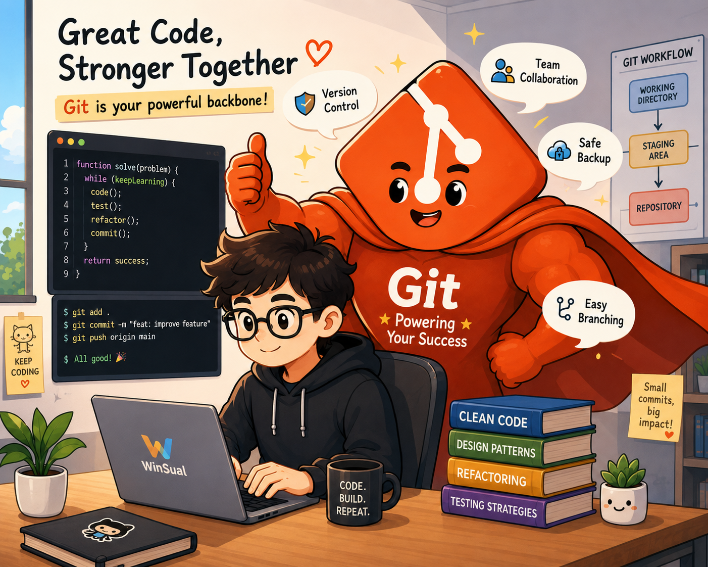

{style="border-radius: 10px;" width="400"}

Yesterday I met a senior software engineer friend for coffee. We talked about one question: in a world full of AI tools, which ones will we still keep using?

Git was our immediate answer. We also spent some time admiring how well Git was designed — yes, we are that kind of people.

`git add`, `git commit`, and `git push` are the commands I use most often. Whether I am building a personal tool or writing a blog post, backup and version control are essential parts of the workflow.

In team collaboration, the full flow — **Clone, branch management, rebase, revert, PR, and merge** — becomes the standard process. When a conflict happens, the communication, coordination, and alignment with teammates goes beyond a technical problem. It becomes a test of how well a team can talk and express ideas clearly.

Of course, AI can help with many of these Git operations. One small thing my friend and I both found amusing: using AI to write commit messages. The accuracy is surprisingly good. But regardless, the core value of Git cannot be replaced. For anyone who writes or manages code, backup and version control will always be a critical part of the job.

---

## Why Git Matters More in the Age of AI

Many people think AI makes version control less important. After all, you can regenerate code quickly — and fast!

**When everyone on a team is using AI to write code faster, collaboration conflicts happen more often — not less. AI helps you write faster, but it does not know what your teammate changed yesterday.**

Git was never about *how* to write code. It is about how multiple people can work at the same time without overwriting each other, losing history, or losing accountability.

Many work environments require every change to be traceable and auditable. Even AI-generated code must go through a proper version control and review process before it enters a production system.

**AI makes you faster. Git keeps your team from breaking things. They are partners, not replacements.**

---

## Version Control in Statistical Programming

Version control matters in statistical programming too. But based on my experience, most companies do not use Git or GitHub directly. This is probably related to data sensitivity and existing workflows.

The two most common approaches I have seen:

1. **A dedicated version control tool** — operated through a UI that supports version comparison, storage, and rollback. The core idea is exactly the same as Git.
2. **A daily backup system** — scheduled copies of all program files saved to a separate storage location. This does protect against file loss, but it does not give you a real change history or effective version control.

---

## Pull Request + Code Review + Conflict Resolution

After a feature is finished, a Pull Request is submitted to ask teammates to review the code. During this process, a Conflict may occur — when two people edit the same section of the same file, Git cannot decide which version to keep. You resolve it manually by reviewing both sides and choosing one, or combining them.

This workflow is different from what I have experienced in statistical programming. In clinical trials, programmers usually work independently on the *same* dataset to check consistency — they do not edit the same program file together.

But the similarity is there: when two collaborators produce different results, you discuss, investigate, and decide which version is correct before it enters the final system.

After today's conversation, here is a summary of the core Git concepts I want to share:

---

**Clone** — The first step when joining a new project. `git clone` does not just download files. It creates a connection to the remote repository and includes the complete version history. Like a new employee on day one — not receiving a static document, but a living one that stays in sync.

**Branch** — When working on a new feature, you do not work directly on the main line. You create a separate branch. The main branch always matches the production system and cannot be modified directly. This is the same logic as separating a development environment from a validated production environment in clinical trials — you do not run experiments directly on a production system.

**Pull / Push** — `git pull` brings remote changes to your local machine. `git push` sends your local commits to the remote. One in, one out. Pull before you start, push when you finish — this is basic collaboration discipline.

**Fetch** — A read-only operation. It downloads the latest information from the remote repository but does not change any local files. You can check what has changed before deciding what to do next. This is a recommended step before starting any work session.

**Merge** — Combines two branches into one. Merge keeps the full branch history, so you can always see when a feature was added, by whom, and from which branch. Best used when bringing a feature branch back into main, to preserve a clear collaboration record.

**Rebase** — Moves all your commits to sit after the latest commit on the target branch, keeping the history clean and linear with no branching nodes. Usually done before opening a PR, so reviewers can follow your changes more easily. Rebase makes history clean. Merge makes history complete. They are not opposites — they serve different moments.

**Pull Request (PR)** — A formal request to merge your branch, with a review step. This is the same action as a statistical programmer submitting code to a QC programmer for review — just on a different platform, GitHub instead of email or a shared folder.

**Conflict** — When two people edit the same section of the same file, Git cannot decide which version to keep. You must resolve it manually. This is the same as when two programmers produce different results and need to meet, discuss, and agree on the correct version before it enters the final system.

**git revert** is the safe choice. It does not delete history — it adds a new commit that records "I undid this action."

**git reset --hard** is dangerous. It removes commits from the history entirely. In the short term, you may be able to recover using `git reflog`, but this is not guaranteed. Use it only on personal branches, with caution.

**Audit trail** — Every operation should leave a record. Any correction should be documented. This is a good habit that must continue even in the age of AI.

---

If you also work in pharma or CRO and are starting to explore engineering tools, feel free to share your experience.
