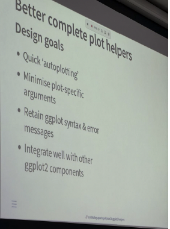

::: {.callout-note}
These are notes from a talk at useR! 2026 (Warsaw, July 6–9).

- **Talk title**: Reusing 'ggplot2' code: how to design better plot helper functions
- **Speaker**: Cynthia A. Huang (postdoctoral researcher at the Social Data Science and AI Lab, LMU Munich, working with Prof. Frauke Kreuter; organizer of the "Grand Unified Grammar of Graphics" workshop at IEEE VIS 2026)
:::

{style="border-radius: 10px;" width="400"}
## 1. Background and Motivation

Cynthia's research interests include "alternative" data for social science research, using LLMs and generative AI in data science work, and grammar-of-graphics visualization systems.

The talk starts from a problem almost every ggplot2 user knows well: we often need to reuse plotting code we wrote before. A helper function can turn a long, complex piece of ggplot2 code into a single function call. But if that function is not designed well, **the early convenience can turn into frustration later**. This happens because the helper hides the layered grammar underneath, which makes it harder to customize or fine-tune the plot afterward.

## 2. Five Common Ways to Reuse ggplot2 Code

1. **Copy & Paste**: The simplest way, but it quickly becomes a "spot the difference" game — two blocks of code that look almost the same, with just one or two lines changed. Even in short scripts, it is easy to miss a change.
2. **Component objects or lists**: Save parts that never change (for example, a `bestfit` object with fixed `geom_smooth(method = "lm", ...)` settings) and just add them with `+` to any plot. This works well when the component is **exactly the same every time**.
3. **Decorators and combination functions**: Combine several components into a list, wrap it in a function, and open up a few parameters (like `geom_mean(mean.fill = ...)`). The problem: once you wrap things up, familiar parameters like `fill` or `color` need new names, and you start moving away from ggplot's own vocabulary.
4. **Complete plot helpers**: Take in data, transform it inside the function, and return a full ggplot object. This is the main topic of the talk.
5. **Extending ggproto objects**: The most advanced route — writing your own stat or geom (the talk references Gina Reynolds's "Easy geom_*() recipes"). The idea itself is not hard, but for someone who just wants to reuse a piece of code, the cost is often too high.

## 3. Case Study: Three Calendar Packages, Three Design Problems

Cynthia uses calendar plots as her example. Two years ago she wanted to make a calendar for her travel dates, and found many calendar packages already existed. She looked closely at three of them and found common interface problems:

- **ggcal (two data inputs)**: The call is very simple — `ggcal(mydate, myfills)` — but this raises questions: how many arguments does this function really take? What format should `dates` and `fills` be in? How do you change the title color? The interface is too vague. The only hint that it uses ggplot is the "gg" in the package name.
- **ggweekly (too many plot-specific arguments)**: The function signature has about 20 arguments, full of plot-specific names like `month_text_size`, `day_number_text_size`, `month_color`, and `weekend_fill`. Even the speaker herself could not remember whether `month_color` changes the text or the tile fill. Users must build their own mental map from "argument name" to "ggplot component," which is hard to maintain.
- **calendR (ggplot sub-arguments)**: Names like `title.size`, `subtitle.col`, and `text.pos` don't even make it clear that ggplot2 is being used underneath. The data preparation is completely hidden inside, so customizing or debugging the plot feels like working with a black box.

::: {.callout-important}
## Core lesson: Beware false savings!

Watch out for "false savings" — sometimes the lines of code you "save" turn into a confusing list of plot-specific arguments. The two typical warning signs: **overly specific function arguments** and **hidden data manipulation**.
:::

## 4. Better Complete Plot Helpers: Design Goals and Three Principles

**Design goals:**

- Fast "autoplotting" — a plot with minimal input
- Fewer plot-specific arguments
- Keep ggplot syntax and **native error messages** (a wrapper that goes too deep makes error messages nested and hard to debug)
- Work well together with other ggplot2 components

**The three principles of "Window Plot Helpers":**

1. **Expose**: Show ggplot syntax as a "recipe" in the interface, instead of inventing a new mini-language (DSL)
2. **Separate**: Keep data preparation and plot construction apart, and make both visible at the interface level
3. **Document**: Write documentation in a "grammatical" way — explain each argument using native ggplot2 vocabulary, showing which geom, scale, or theme it maps to

## 5. Worked Example: ggtilecal

The `ggtilecal` package uses ggplot2's `geom_tile()` geometry to draw calendars. The original script is over 100 lines long. It includes data preparation (reshaping with `reframe()`, filling in missing days, calculating month/week layout variables for facets) and ggplot components (scale/coord/facet layout, theme changes, an interactive geom from {ggiraph}). After wrapping it into a package:

- **A convenient autoplot**: `make_empty_month_days()` first creates a date sequence, then `gg_facet_wrap_months(.events_long = dates, date_col = unit_date)` makes the plot in just two or three lines.
- **List arguments as a "window" interface**: The function signature is grouped into sections — data arguments first (`.events_long`, `date_col`, `locale`), then facet/layout arguments (`week_start`, `nrow`, `ncol`), and finally default component groups: `.geom = list(geom_tile(...), geom_text(...))`, `.scale_coord = list(...)`, `.theme`, and `.others` (a catch-all).
- **Modular internals**: Inside the function, the code is clearly split into "Data Helpers" (`fill_missing_units()` then `calc_calendar_vars()`) and "Plot Construction." List arguments are added as layers with `+`, so everything stays transparent.
- **Grammatical customization**: Users don't need to learn new arguments — they just use the ggplot knowledge they already have to change the list content. For example, change `geom_text(color = "#6a329f")` to purple, or add `theme(strip.background = element_rect(fill = "#d9d2e9"))` inside `.theme`.
- **Three things the documentation explains**: the data preparation steps, how the ggplot "recipe" is built, and which ggplot component each interface element maps to (for example, `geom_tile` maps to "the tile for one day").

## 6. Hands-On Practice: Comparing Four Reuse Methods with a Waterfall Plot

The talk lists five ways to reuse ggplot2 code (see Section 2). Here, the first method — plain copy & paste — is skipped, since it has no real design to discuss. Instead, I apply the other four methods to my own **RECIST Waterfall Plot template** (`waterfall_template_final.R`). The numbering follows the speaker's original order, so it is easy to compare:

- Method 2: Component objects or lists
- Method 3: Decorators and combination functions
- Method 4: Complete plot helpers
- Method 5: Extending ggproto objects

### 6.1 Summary of the Original Script: waterfall_template_final.R

Before looking at the four reuse methods, here is a summary of the original script's structure, so you can see what it looked like "before" the redesign.

Source of the original file: [github.com/winklelu/WinSual/tree/main/tools/waterfall-plot](https://github.com/winklelu/WinSual/tree/main/tools/waterfall-plot)

The original template is a **single, linear script** meant to be run from top to bottom. It has five parts:

1. **Load packages**: `ggplot2`, `dplyr`, `tibble`, `reporter` (for RTF output)
2. **Create dummy data**: Simulate two treatment arms, and work backward from Best Overall Response (CR/PR/SD/PD) to get matching percentage change from baseline (PCHG) values
3. **Prepare the data**:
   - If a subject has more than one visit, use `group_by() + slice_min()` to keep the best (lowest) PCHG
   - Sort by PCHG from low to high, and turn `USUBJID` and `TRTA` into factors, so the x-axis order and colors stay fixed
4. **Build the plot**: One single `ggplot()` call chains all the layers together — `geom_col()` for the bars, `geom_text()` to label BOR (with `vjust` direction set by whether PCHG is positive or negative), three RECIST 1.1 reference lines (`geom_hline()` at +20%, −30%, and 0), `scale_fill_manual()` for colors, and `theme_classic()` as a base with a long `theme()` block on top for further styling
5. **Export**: `png()` saves a high-resolution image, and the `reporter` package builds an RTF report

**This script is a typical example of what Cynthia calls "before helper design."** Data preparation and plot logic sit in the same file, with no clear line between them. All customization (colors, fonts, reference-line positions) is written as fixed values. To make a plot with different colors or a different group of subjects, you would need to copy the whole file and edit it by hand — this is exactly where the "copy & paste" method starts (Section 2). The four methods below show, step by step, how this script can be broken apart.

### 6.2 Method 2: Component Objects or Lists

Two parts of the script never change, no matter which waterfall plot you draw: the RECIST reference lines and the theme. Save them as separate objects:

```r
recist_ref_lines <- list(
  geom_hline(yintercept =  20, linetype = "dotted", color = "grey40", linewidth = 0.4),
  geom_hline(yintercept = -30, linetype = "dotted", color = "grey40", linewidth = 0.4),
  geom_hline(yintercept =   0, color = "black", linewidth = 0.35)
)

theme_winsual_waterfall <- theme_classic(base_size = 11, base_family = "serif") +
  theme(
    plot.title  = element_text(size = 12, face = "bold", hjust = 0),
    axis.text.x = element_text(size = 6.5, angle = 90, hjust = 1, vjust = 0.5),
    # ... (rest of the settings stay the same as the original template)
  )

ggplot(wf_df, aes(x = USUBJID, y = PCHG, fill = TRTA)) +
  geom_col(width = 0.8, color = "white", linewidth = 0.15) +
  recist_ref_lines +          # just add it with +
  scale_fill_manual(values = ARM_COLS, name = "Treatment") +
  theme_winsual_waterfall     # just add it with +
```

**Comment**: This method uses plain ggplot syntax, with no extra learning needed — the lowest cost of all four methods. But there is no room for customization at all. If you ever need to change +20% to +25%, you must edit this object directly, or copy the whole thing under a new name. In other words, the "copy & paste" problem has just moved from the script level to the object level.

### 6.3 Method 3: Decorators and Combination Functions

Wrap the BOR label into a function, and open up a few parameters:

```r
geom_bor_label <- function(label_size = 2.0, label_color = "grey20") {
  geom_text(
    aes(label = BOR, vjust = ifelse(PCHG >= 0, -0.4, 1.3)),
    size = label_size, family = "serif",
    color = label_color, fontface = "bold"
  )
}

p + geom_bor_label(label_size = 2.2, label_color = "grey30")
```

**Comment**: This is convenient to use, but the cost shows up right away. `label_size` and `label_color` are renamed versions of `geom_text()`'s own arguments — a user must check the function definition to know they map to the native `size` and `color`. Meanwhile `family` and `fontface` are locked inside the function and cannot be changed at all. This is a small, clear example of "Beware false savings!" — you save two lines of `geom_text()`, but end up with a naming problem that gets harder to maintain over time.

### 6.4 Method 4: Complete Plot Helpers

This is the main solution from the talk: separate data preparation from plot logic, and use **list arguments** for customization instead of renamed, function-specific arguments.

```r
## Data helper: kept separate from the plotting logic
prep_waterfall_data <- function(data, subject_col, arm_col, value_col, bor_col, arm_levels = NULL) {
  data <- data %>%
    rename(USUBJID = {{ subject_col }}, TRTA = {{ arm_col }},
           PCHG = {{ value_col }}, BOR = {{ bor_col }}) %>%
    group_by(USUBJID, TRTA, BOR) %>%
    slice_min(order_by = PCHG, n = 1, with_ties = FALSE) %>%
    ungroup()
  if (is.null(arm_levels)) arm_levels <- levels(factor(data$TRTA))
  data %>%
    arrange(PCHG) %>%
    mutate(USUBJID = factor(USUBJID, levels = USUBJID),
           TRTA = factor(TRTA, levels = arm_levels))
}

## Plot construction: a "window" interface, customized through lists
winsual_waterfall <- function(
    data, subject_col, arm_col, value_col, bor_col,
    arm_levels   = NULL,
    .fill_colors = NULL,
    .ref_lines   = recist_ref_lines,
    .label       = list(size = 2.0, family = "serif", color = "grey20", fontface = "bold"),
    .theme       = theme_winsual_waterfall,
    .labs        = list(title = "Waterfall Plot", x = "Subject ID", y = "Best % Change")
) {
  wf_df <- prep_waterfall_data(data, {{ subject_col }}, {{ arm_col }}, {{ value_col }}, {{ bor_col }}, arm_levels)
  if (is.null(.fill_colors)) {
    palette <- c("#BC3C29", "#0072B5")
    .fill_colors <- setNames(palette[seq_along(levels(wf_df$TRTA))], levels(wf_df$TRTA))
  }

  ggplot(wf_df, aes(x = USUBJID, y = PCHG, fill = TRTA)) +
    geom_col(width = 0.8, color = "white", linewidth = 0.15) +
    do.call(geom_text, c(
      list(mapping = aes(label = BOR, vjust = ifelse(PCHG >= 0, -0.4, 1.3))),
      .label
    )) +
    .ref_lines +
    scale_fill_manual(values = .fill_colors, name = "Treatment") +
    do.call(labs, .labs) +
    .theme
}

## Usage: default settings, one line to get a plot
winsual_waterfall(adrs, USUBJID, TRTA, PCHG, BOR)

## Usage: customize using geom_text() syntax you already know — no new argument names to learn
winsual_waterfall(adrs, USUBJID, TRTA, PCHG, BOR,
  .label = list(size = 2.5, family = "sans", color = "grey10", fontface = "plain"))
```

#### Breaking down the `do.call()` syntax

`.label` is a list (like `list(size = 2.0, family = "serif", ...)`), but `geom_text()` expects named arguments, not one packed list. If you write `geom_text(.label)` directly, the whole list gets treated as the first argument, `mapping`, by mistake. `do.call(FUN, args)` solves this: it takes each item in the `args` list and unpacks it into a separate named argument for `FUN`:

```r
do.call(geom_text, list(size = 2.0, color = "grey20"))
## is the same as:
geom_text(size = 2.0, color = "grey20")
```

`c(list(mapping = aes(...)), .label)` **merges** two lists from different sources — the mapping that the function author locks in place, and the style parameters the user is allowed to change — into one list, which is then passed to `geom_text()`. Here `c()` is joining two lists, not two vectors:

```r
c(list(a = 1), list(b = 2, c = 3))
#> $a
#> [1] 1
#> $b
#> [1] 2
#> $c
#> [1] 3
```

#### Three kinds of "argument packages" and how the function treats them

| Argument | What it is | How it's added to the plot | Can the user change it? |
|---|---|---|---|
| `aes(label = BOR, vjust = ...)` | A fixed mapping | Wrapped in `list(mapping = ...)`, then merged with `.label` | ❌ Not open — this is a core rule |
| `.label` | Named arguments to be assembled | `do.call(geom_text, c(list(mapping=...), .label))` | ✅ Can be changed at call time — pure appearance |
| `.ref_lines` | An already-built list of layers | Added directly with `+ .ref_lines` | ✅ Can be changed at call time |
| `.theme` | An already-built theme object | Added directly with `+ .theme` | ✅ Can be changed at call time |

**An important correction (a wrong assumption fixed)**: `aes(label = BOR, ...)` is **not** the part with the most flexibility that should be "unpacked" for editing. It is actually the opposite — it is **deliberately locked and not open** for change, because "always label BOR" and "always push labels in different directions for positive and negative values" are part of what makes this a waterfall plot. The user should not be able to accidentally override this. The real flexible part is `.label` (pure visual style). The point of `do.call()` is not to "unpack `aes()`" — it is to "merge the fixed mapping with the adjustable style arguments."

#### An analogy with SAS macros

Method 4 shares the same design idea as a SAS macro (wrapping a repeated process into `%macro...%mend`, with parameters controlling the differences), but the underlying mechanism is different:

- **SAS macro**: The macro processor does **text substitution** — it builds the full code first, then runs it as one block. Once the macro finishes, the output is fixed. Unless the macro has a built-in slot like `moreStmts=` or `extra_stmts=%str(...)` for passing in raw code, you cannot add anything to it afterward.
- **R function**: Calling the function returns a **live ggplot object**, which can still be extended with `+` after the call (for example, `winsual_waterfall(...) + labs(caption = "...")`). The function author does not need to prepare this in advance.

List arguments like `.label` and `.ref_lines` are, in spirit, closest to SAS's `extra_stmts=%str(...)` — they pass in "native syntax" as a parameter, instead of opening a separate named argument for every possible customization.

#### The hard part: deciding what to lock and what to open up

This is the hardest part of Method 4, and there is no single formula. A few practical rules can help narrow it down:

1. **Ask "Has this actually changed across my real use cases?"**: Don't guess in advance what should be open. Lock it down first, and pay attention to what you actually change the second or third time you reuse the function — that is what should become an open parameter. If something has never changed, keep it locked, so you avoid ending up with 20 arguments like ggweekly.
2. **Ask "Is this 'what to draw' or 'how it looks'?"**: The part of `aes()` that maps data to visual channels ("what to draw") is usually part of the plot's identity and should stay locked. Color, font, size, and other appearance settings ("how it looks") are usually safe to open up.
3. **Apply the "narrow settling point" test**: If you spend more than a minute deciding whether a parameter should be open, that is often a sign the need has grown beyond "a small team reusing the same plot." At that point, consider writing a separate function or using ggproto, instead of forcing it into the argument list.
4. **Use "does the user need to learn something new" as a test**: For every open parameter, check whether the user needs to read the documentation first to understand it (like `label_size`). If so, you are repeating the Method 3 problem. If the parameter name is already native ggplot vocabulary (like `size`), the user does not need to learn anything extra.

There is no design that gets everything right on the first try. **It is normal — and healthy — for the rules you locked in the first version to later prove wrong through real reuse, leading you to refactor.**

### 6.5 Method 5: Extending a ggproto Object

Wrap the logic "pick each subject's best response" into a reusable Stat. The benefit: this same calculation can later be reused for other plot types, like a Spider Plot, without copying `group_by() + slice_min()` every time.

```r
compute_group_bestchange <- function(data, scales) {
  data %>% slice_min(order_by = y, n = 1, with_ties = FALSE)
}

StatBestChange <- ggproto("StatBestChange", Stat,
  required_aes = c("x", "y"),
  compute_group = compute_group_bestchange
)

stat_bestchange <- function(mapping = NULL, data = NULL, geom = "col", ...,
                            show.legend = NA, inherit.aes = TRUE) {
  layer(
    stat = StatBestChange, geom = geom, data = data, mapping = mapping,
    position = "identity", show.legend = show.legend,
    inherit.aes = inherit.aes, params = list(...)
  )
}

## Usage: pass in raw, long-format data with multiple visits per subject —
## no need to filter it by hand first
ggplot(adrs, aes(x = USUBJID, y = PCHG, fill = TRTA)) +
  stat_bestchange(width = 0.8, color = "white") +
  recist_ref_lines
```

#### What `required_aes = c("x", "y")` does

This line means: any layer using `stat_bestchange()` **must** have `x` and `y` mapped in `aes()`. If not, ggplot2 will catch the problem and give an error **before** drawing the plot, instead of failing halfway through `compute_group_bestchange()` because `data$y` turns out to be `NULL`:

```r
ggplot(adrs, aes(x = USUBJID, fill = TRTA)) +   # forgot y = PCHG
  stat_bestchange()
#> Error: stat_bestchange requires the following missing aesthetics: y
```

This is exactly how ggplot2 **avoids the problem of nested error messages** — the responsibility for checking inputs moves up to the framework level, so `compute_group()` can safely assume `data$x` and `data$y` already exist. `required_aes` (the user must provide this, or get an error) and `default_aes` (a default value used when the user doesn't provide one, with no error) are two different things. This example only declares the first one.

#### Being honest about this method's limits

`stat_bestchange()` does remove the need to write `group_by() + slice_min()` by hand, and the logic becomes "a component that can be attached to any plot" — useful again for a future Spider Plot. But a waterfall plot also needs the x-axis to be sorted by PCHG **across the whole dataset**, and `compute_group()` is designed to work **group by group**. It has no way to handle a global task like "arrange the x-axis factor levels" from inside the stat. The example above still needs `USUBJID` to be sorted beforehand, or the bars will not form the waterfall shape.

This matches Cynthia's own judgment: "picking the best value per subject" is a general piece of logic that fits well into ggproto, but "sorting the whole x-axis" is really a data-preparation task. Forcing it into ggproto adds complexity without adding equal value — a concrete case of "the cost is too high."

### 6.6 Summary: Where the Four Methods Fit

| No. | Method | Best used when | Example in this case |
|---|---|---|---|
| Method 2 | Component objects | Elements that never change | RECIST reference lines, theme |
| Method 3 | Decorator function | A small amount of convenience, but naming can drift from the original | BOR labels (shows the naming problem) |
| Method 4 | Complete plot helper | The best fit here — separates data from plotting, with grammatical customization | `winsual_waterfall()` |
| Method 5 | ggproto extension | Only worth it when the calculation needs to be reused across several plot types — and it's important to be honest that not every piece of logic fits well into a stat | `StatBestChange` (works well for picking the best value per subject, but not for sorting the x-axis) |

