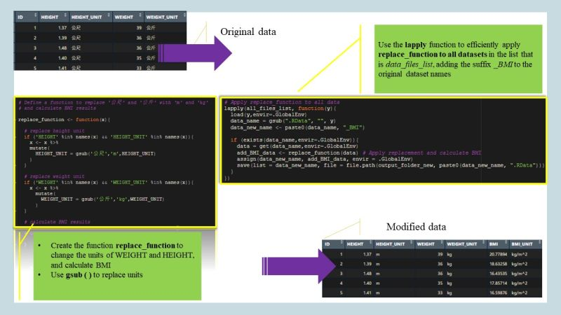

{style="margin-bottom: 1em; border-radius: 8px;" width="779"}

## 🔁 Introduction

In data analysis, we often encounter situations where we need to perform the **same transformation or calculation on multiple datasets** — such as datasets grouped by age, treatment, or study phase.

Rather than repeating the same code block over and over, R provides a more efficient, less error-prone solution: the **`lapply()`** function.

## ✨ Why Use `lapply()`?

When you have more than 5 or even 10 datasets to process, using a loop or manually running the same function can quickly become tedious and risky. By placing all target datasets in a **list** and applying a custom function via `lapply()`, you can:

-   Minimize code repetition\
-   Reduce the chance of mistakes\
-   Improve code scalability and clarity

## 🔧 Example: Adjust Units and Calculate BMI

Let’s say you have datasets containing **weight (in 公斤)** and **height (in 公尺)** for different age groups. The goal is to:

1.  Convert the units from Chinese characters to standard abbreviations (`kg`, `m`)\
2.  Calculate the **Body Mass Index (BMI)** using the formula:

$$
\text{BMI} = \frac{\text{weight (kg)}}{\text{height (m)}^2}
$$

### 📦 Step 1: Create Sample Datasets

``` r
# Sample data for three age groups
group1 <- data.frame(Height = c("1.65公尺", "1.70公尺"), Weight = c("60公斤", "65公斤"))

group2 <- data.frame(Height = c("1.60公尺", "1.75公尺"), Weight = c("55公斤", "70公斤"))

group3 <- data.frame(Height = c("1.72公尺", "1.80公尺"), Weight = c("68公斤", "75公斤"))
# Combine them into a list
groups <- list(group1, group2, group3)
```

🔧 Step 2: Define a Custom Function

``` r
# Function to convert units and calculate BMI
replace_function <- function(df) {
  df$Height <- as.numeric(gsub("公尺", "", df$Height))  # Remove '公尺' and convert to numeric
  df$Weight <- as.numeric(gsub("公斤", "", df$Weight))  # Remove '公斤' and convert to numeric
  df$BMI <- round(df$Weight / (df$Height^2), 1)         # Calculate BMI
  return(df)
}
```

🚀 Step 3: Apply the Function Using `lapply()`

``` r
# Apply the same function to all groups
results <- lapply(groups, replace_function)

# Preview the result for group1
results[[1]]
```

✅ Output (example)

``` r
  Height Weight  BMI
1   1.65     60  22.0
2   1.70     65  22.5
```

## 💡 Final Thoughts

The **combination of `lapply()` and `gsub()`** demonstrates a powerful pattern in R: clean, consistent, and reproducible operations across datasets.

Whether you’re dealing with different demographic groups or multiple study arms, putting your datasets in a list and defining a reusable function can save time and prevent mistakes — especially in clinical trial data preparation or large-scale reporting tasks.

Happy coding!
