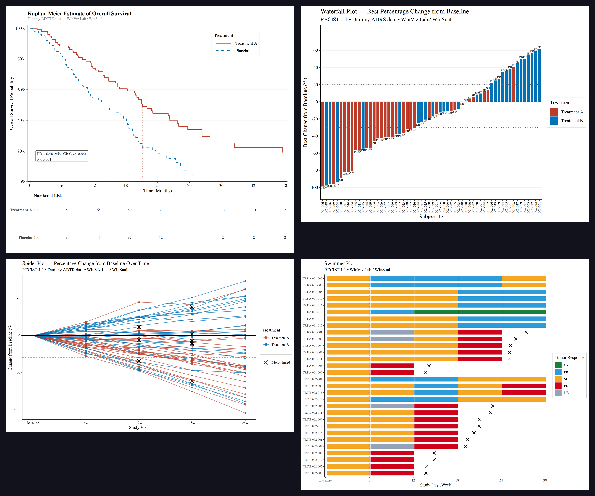

If you ask me what plots I have made most often in clinical trials, my answer would be: Spider Plot, Swimming Plot, Waterfall Plot, and KM Plot.

These are the figures you will see in almost every oncology study — during the trial, in the final CSR, and even in publications. They carry meaning across data monitoring, data cleaning, and efficacy evaluation.

---

## RECIST 1.1 Is Not Just Arithmetic

In oncology clinical trials, we often say RECIST 1.1 is the gold standard.
But as a statistical programmer, I have learned that it is much more than simple arithmetic.
The real challenge lies in **dimensional precision**, **time consistency**, and the most overlooked part — **CRF design logic**.

---

## Three Dimensions You Must Understand

### Lesion Categorization

Accurately separate target lesions (measurable, up to 5 total, max 2 per organ) from non-target lesions (qualitative only). This is the foundation of everything that follows.

> **Practical insight:** Many CRF design problems start here. If a lesion is defined as a target lesion at baseline, it must be measurable at every follow-up visit. When "unable to assess" appears frequently on the Target Lesion page, it usually means the selection logic or data definition had a problem from the beginning. This kind of issue is often buried in the CRF design before the study even starts.

### Anatomy Measurement

- General lesions: measure the **longest diameter**
- Lymph nodes: measure the **short axis**

This is one of the most common mistakes I see during data cleaning — the short axis is the correct measurement to determine whether a lymph node has returned to normal.

### Baseline and Change

By calculating the percentage change in the sum of diameters (SoD), we define:

| Response | Definition |
|---|---|
| **CR** | All target lesions disappear |
| **PR** | SoD decreases ≥ 30% from baseline |
| **PD** | SoD increases ≥ 20% from nadir AND ≥ 5 mm absolute, or new lesion appears |
| **SD** | Between PR and PD |

---

## Time Logic: Confirmation and SD Threshold

The most demanding part of data monitoring is managing time carefully:

**Confirmation:** After the first CR or PR, a follow-up scan is usually required around 4 weeks later. An unconfirmed PR must be handled carefully in data annotation.

**SD time threshold:** Stable disease (SD) must meet a minimum time interval defined in the protocol (usually at least 6–8 weeks from baseline). Otherwise, it may be classified as not evaluable (NE).

---

## Why These Four Plots Are "Live Documents"

As data accumulates during the trial, these plots grow with it — and help us catch data issues in real time.

{style="border-radius: 10px;" width="100%"}

### Waterfall Plot — A "Snapshot" of Efficacy

Shows each patient's best percentage change from baseline, ordered from best to worst.

- Quickly spots outliers and flags potential data entry errors
- BOR labels on each bar let you check whether BOR and PCHG are logically consistent
- Colour by treatment arm — no need to split the plot to compare two groups

→ Most used for: data entry error detection, early ORR estimation, DMC reports

### Spider Plot — A "Navigation" of Trends

Shows each patient's tumor change over time, one line per patient.

- Tracks the nadir and warns when SD patients are moving toward PD
- Discontinued patients are marked with ✕ at their last observation point
- The trajectory shows whether the drug effect is durable or whether there is a "false response" followed by rapid progression

→ Most used for: tumor dynamic monitoring, pre-confirmation PR warning, early efficacy signal detection

### Swimming Plot — A "Full Picture" of the Patient Journey

Shows each patient's complete on-study timeline, with colour blocks for each assessment interval.

- Colour blocks represent tumor response (CR/PR/SD/PD) and clearly show duration of response (DoR)
- The ✕ marker is placed between assessments — after the last visit but before the next scheduled one — which better reflects clinical reality
- Optional event markers (e.g. First PR, First PD, Death) can be added to highlight key clinical events

→ Most used for: DoR presentation, DMC overview reports, confirmed PR annotation, individual patient data review

### KM Curve — Survival Over Time

The Kaplan-Meier curve shows the probability of survival (or event-free status) over time by treatment arm.

- HR and p-value annotation directly on the plot
- Risk table aligned to x-axis time points
- Validated against Phase III CSR results (HR = 0.79, p = 0.0145)

→ Most used for: primary endpoint reporting, regulatory submissions, publication figures

---

## Data Is Not Just Presentation — It Is Governance

Through years of experience, I have learned that a well-designed plot makes data problems impossible to hide.

We are not just making charts. We are having a conversation with the data through these visualisations. Updating these plots regularly ensures that every response assessment is backed by the most rigorous RECIST 1.1 logic.

This is what I have always believed — **let the data tell the most honest and timely story.**

---

## R Templates on WinViz Lab

All four templates are built with open-source R tools:

```r
# Core packages used across all four plots
library(ggplot2)    # plotting
library(dplyr)      # data manipulation
library(survival)   # KM curve (survfit)
library(reporter)   # RTF output for regulatory submissions
```

Key design decisions shared across all templates:

- **Dynamic arm levels** — `levels(factor(adrs$TRTA))` instead of hardcoded values
- **Consistent colour mapping** — `setNames(c(COL_A, COL_B), arm_levels)`
- **RTF output** — publication-ready via the `reporter` package
- **PNG + RTF dual output** — for both web sharing and submission packages

The templates are available on **WinViz Lab** — free to use and adapt:

👉 [winklelu.github.io/WinSual/winviz.html](https://winklelu.github.io/WinSual/winviz.html)
