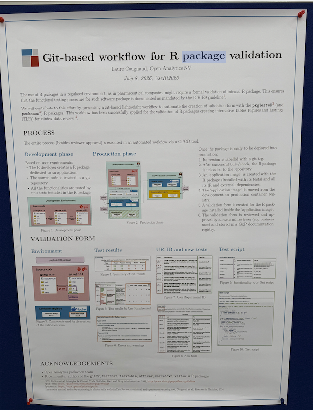

{style="border-radius: 30px;" width="500"}

📌 *This post is based on my notes from Laure Cougnaud's poster "Git-based workflow for R package validation" at useR! 2026 in Warsaw (July 8, 2026). All credit for the original idea and the pkgTesteR package goes to the Open Analytics NV team.*

------------------------------------------------------------------------

## Why This Poster Caught My Eye

At useR! 2026 in Warsaw, one poster made me stop and read it twice. The title was simple: a git-based workflow for validating R packages. But two words in that title are close to my heart — **Git** and **validation**.

In a regulated environment like pharma, an R package usually needs a formal validation before it can be used in production. This comes from guidelines like ICH E9. But in most teams, the validation form is still built by hand. As the package grows and changes over time, keeping this form consistent gets harder and harder.

This poster showed a different way to solve that problem.

## Three Layers, Not One Tool

When I looked closer at the workflow, I saw it is really built from three separate layers. Two of them are tools the whole R community already uses. Only one layer is new.

### 1. [testthat](https://testthat.r-lib.org/) — a well-known testing tool

testthat is a unit testing framework for R, created by Hadley Wickham. It is one of the most common tools in the R community. Developers use it to write test cases for their functions, and each test returns one of three results: pass, fail, or warning. This layer checks one simple thing: does the code actually do what it should do?

### 2. Git tags — a well-known version control feature

Git already tracks every change (every commit) in a project. But this workflow does not look at every single commit. It uses **git tags** instead — a label placed on one specific commit, like `v1.0.0`. In a regulated setting, what matters is not every daily change, but the difference between one official version and the next. A tag marks exactly where that official version sits.

### 3. [pkgTesteR](https://github.com/openanalytics/pkgTesteR.git) — the new part

This is where the real technical contribution sits. The pkgTesteR package does four things:

-   It reads the **description text** of each testthat test, and turns it into a **User Requirement (UR)** — a plain statement of what the function is supposed to do.
-   It numbers each UR **in order**, based on the git history. When a new version is released, the numbering continues from the last version instead of starting over. This keeps the form consistent across versions.
-   It compares two git tags and automatically finds which tests are new or changed between them.
-   It produces a structured **validation form** that an external reviewer (for example, a business user) can read, sign off, and store in a GxP document registry.

## Where It Was Applied

The team demonstrated this workflow on **clinDataReview**, their own open-source R package for interactive medical and safety monitoring in clinical trials, already published in *Frontiers in Medicine* (2024).

## What I Think the Real Innovation Is

testthat and git are both mature, widely-used tools — nobody had to invent them for this. The clever part is the middle layer, pkgTesteR. It takes something a developer already does — writing tests — and turns it into something regulatory teams already need — a traceable requirement document. These two things used to be built and maintained separately. Now the second one comes almost for free from the first.

This touches on a problem I think about often in my own work: **end-to-end traceability** from raw data through to the final output is still an unsolved problem across both SAS and R environments. This poster does not solve the whole problem, but it solves one real piece of it — traceability at the package level.

## How to Review This Testing Process and Tool Design

A tool like this shifts where the real review work happens. It is worth thinking through what a reviewer should actually check, both in the test suite and in the tool itself.

First, **test coverage becomes the real question.** Since every User Requirement comes from a testthat description, the UR list is only as complete as the tests behind it. A reviewer should ask: does this test suite actually cover every requirement that matters, not just the ones that were easy to write a test for? Good test coverage is no longer just a code-quality habit — it becomes part of the validation evidence itself.

Second, **automation speeds up detection, not judgment.** The tool can tell you instantly which tests are new between two git tags. What it cannot tell you is whether that change reflects a meaningful shift in requirements, or just a small refactor. That judgment call still belongs to the human reviewer — the tool's job is to make sure nothing new slips past unnoticed, so the reviewer can spend their attention on the changes that actually matter.

Seen this way, the design is honest about its own boundary: it automates the bookkeeping of validation, and leaves the actual scientific and regulatory judgment to the people who are qualified to make it.
