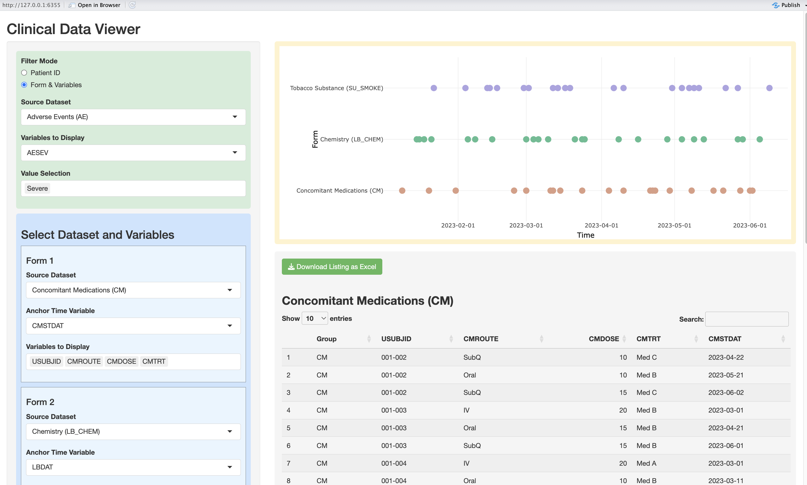

{style="border-radius: 30px;" width="100%"}

If a programmer's passion produces results, then collaborating with the medical team is what gives those results genuine clinical meaning.

Working alongside medical reviewers has taught me a great deal about how clinical data is interpreted. When they conduct data review, they are looking at relationships across different CRF forms — how adverse events, lab results, exposure records, and concomitant medications connect over time. The challenge is that EDC systems typically present one subject and one form at a time. Reviewing multiple forms for a single patient means opening several browser windows and switching between them constantly. It is time-consuming and easy to miss things.

Because data monitoring takes significant effort, the medical team often turns to statistical programmers for support. But programmers tend to think in CDISC terminology — SDTM variable names, ADaM derivations — while reviewers think in clinical language. That translation gap adds friction to every conversation.

This gap was the starting point for what I presented at ShinyConf 2025: a concept for using Shiny with raw CRF data to make clinical data review more intuitive for the medical team. Recently, working together with Claude, I revisited that original demo and cleaned it up properly. The code and documentation are now open-sourced — link in the comments.

---

## Key Features

### Filter Mode — Two Ways to Find Patients

- **Patient ID mode**: Select one or multiple subjects directly from a dropdown
- **Form & Variables mode**: Filter subjects by selecting a CRF field and value — the app identifies which subjects match and displays their data across all selected domains

### Data Display — Timeline + Listing Together

- **Interactive timeline (Plotly)**: Each domain's time points are plotted on a shared axis. Hover over any point to see the full record details without switching screens
- **Click to highlight**: Clicking a point on the timeline highlights the corresponding row in the listing table below (yellow)
- **Multi-domain listings**: Each selected domain is displayed as a separate sortable table
- **CRF filter highlighting**: In Form & Variables mode, matching data points are marked in black on the timeline

### Form Configuration — Review Multiple Domains at Once

Reviewers typically need to compare 2 to 5 forms simultaneously to understand the relationships between them. Each form slot can be configured independently:
- Source dataset
- Anchor time variable for the timeline
- Variables to display in the listing

### Export — Keeping the Excel Habit

Reviewers are used to saving their work in Excel. The download function exports all selected domain listings as a multi-sheet Excel file, one sheet per domain — preserving a record of what was reviewed that Shiny alone cannot provide.

---

## What We Improved This Time

Working with Claude, I restructured and cleaned up the original demo across four areas.

### Architecture — Modular File Structure

The app is now split into three separate files:

```
clinic_review_tool/
├── clinic_review.R   # Main app (UI + Server)
├── data_dummy.R      # Simulated CRF data
└── calculate.R       # Utility functions
```

The data layer is fully separated from the application logic. To use real EDC data, only `data_dummy.R` needs to be replaced — no changes to the main app are required.

### Bug Fixes

- **USUBJID source**: Previously pulled from AE only, which could miss subjects who only appeared in other domains. Now aggregated across all domains
- **Click highlight with multiple subjects**: Added USUBJID matching to the click logic so the correct row is highlighted when multiple subjects are displayed
- **Filter mode residual display**: When switching between Patient ID and Form & Variables modes, selections in the blue panel were not fully cleared. Fixed by using `character(0)` instead of `NULL` in `updateSelectInput`

### Feature Extension

- **Dynamic form count**: Previously hardcoded to 3 forms. Now configurable via `MAX_FORMS = 5`, making it easy to extend

### Code Quality

- Removed all `print()` debug messages left from development
- Removed commented-out legacy code blocks
- Consolidated duplicate for loops into a reusable `get_form_selection()` function

---

## A Note on Data Format

This tool works with **raw CRF data directly**. CDISC-compliant datasets (SDTM or ADaM) are **not required**.

The only requirements are:
- A `USUBJID` column in each dataset
- At least one date column (column name ending in `DAT`) as the timeline anchor

This makes the tool accessible at any stage of a trial — even before CDISC mapping begins.

---

## GitHub

The full source code, dummy data, and documentation are available at:

[https://github.com/winklelu/WinSual/tree/main/tools/clinic_review_tool](https://github.com/winklelu/WinSual/tree/main/tools/clinic_review_tool)

---

Revisiting a past project through AI collaboration turned out to be more than just a cleanup exercise — it sparked new ideas and reinforced why building tools around real clinical needs is always worth the effort.
