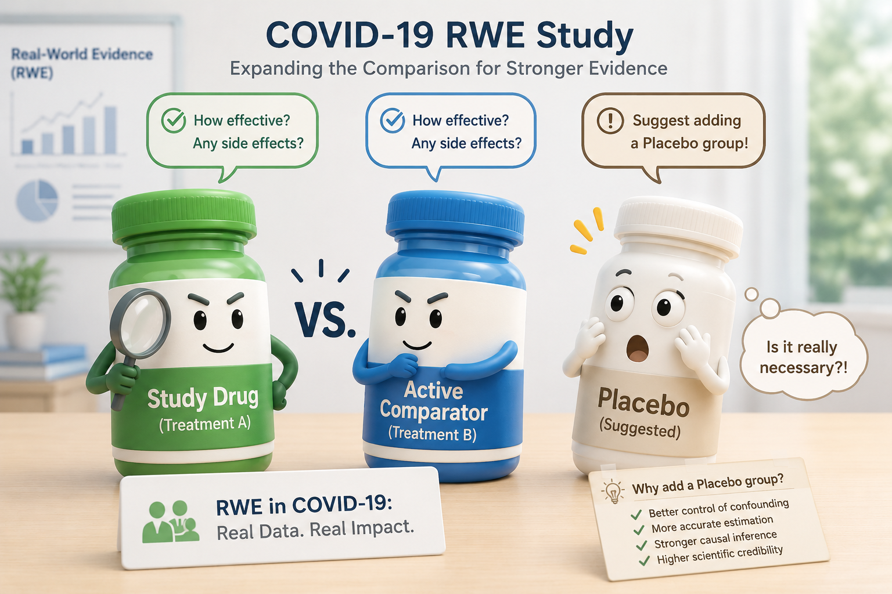

{style="border-radius: 20px;" width="70%"}

👉 **Question for you:** *Have you worked with EMR source data? How would you split the work?*

---

## The Shock

"You need a placebo comparison." — But the CSR was already final. What a shock 😅

I still remember that moment. Our biggest project of the year, a COVID-19 study, was under review. The reviewers questioned the study design: it compared the study drug with a reference drug, but they felt a placebo comparison would be more convincing.

The problem: enrollment was long finished. We could not go back and add a placebo group.

---

## The Solution: An External Control Arm from RWD

The company's solution: use real-world data from the electronic medical records (EMR) of several large hospitals. We selected patients who used neither the study drug nor the reference drug, and built an external control arm to strengthen the evidence.

This is not a special case — it is a classic use of RWE. The 21st Century Cures Act (2016) asked the FDA to build an RWE framework. The FDA published its RWE Framework in 2018, and in 2023 released specific guidance on externally controlled trials. When a placebo arm is not possible — for ethical reasons, rare-disease enrollment, or, like us, a trial that was already complete — an RWD external control is now a recognized way to support the evidence.

---

## ⛔ The Real Challenge Was in Programming

EMR data is completely different from EDC data — very noisy, with no consistent structure, and most problems come from just a few source forms. With the traditional SDTM task-based split, everyone would hit the same data problems and repeat the same work.

So, as co-lead, I proposed a new structure based on data flow, with three groups:

▸ **Source data cleaning — 2 members:** the ones who know the source best solve the noise in one place

▸ **ADaM-like datasets — 4 members:** they receive clean data, no firefighting

▸ **TLF — 4 members:** they focus on the RWE outputs

The result: all TLFs delivered on time, with half the planned manpower.

---

## What This Project Taught Me

The bottleneck in RWE is often not the statistical method. It is how you organize people to face messy data. **Team design is itself a programming strategy.**

**Back to you:** Have you worked with EMR source data? How would you split the work?
