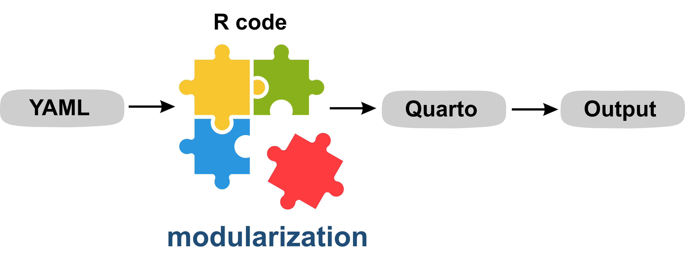
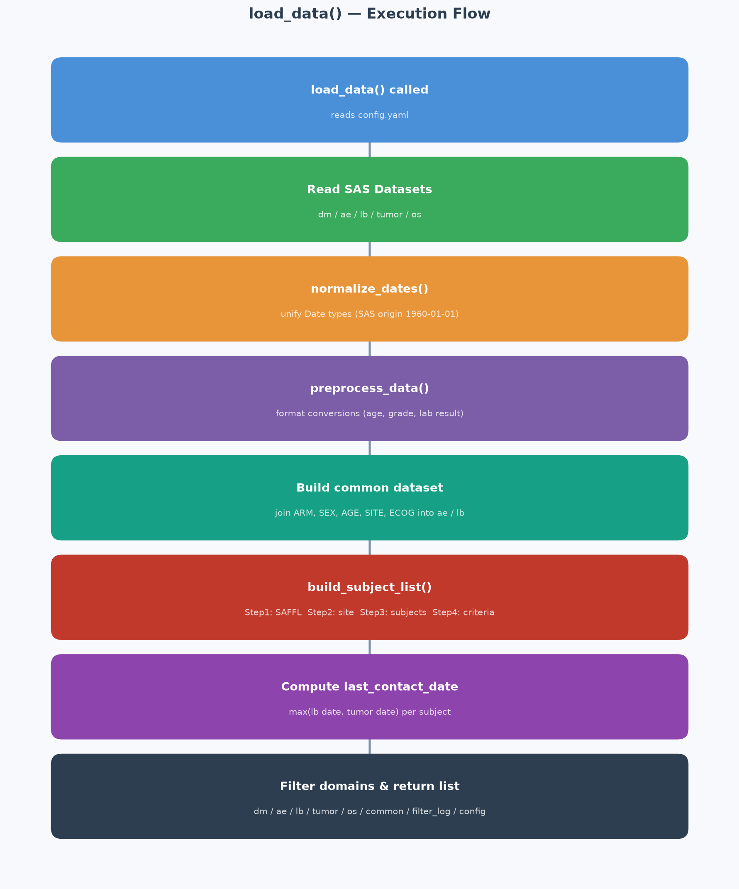
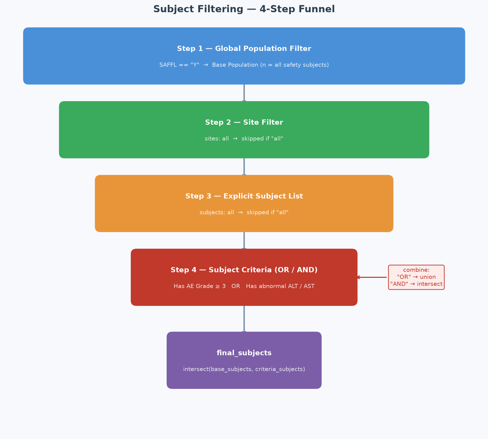
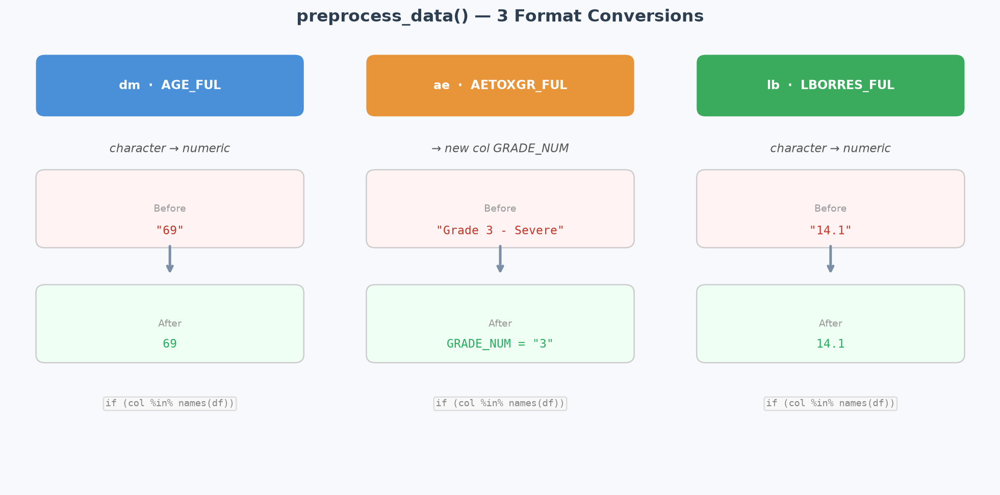
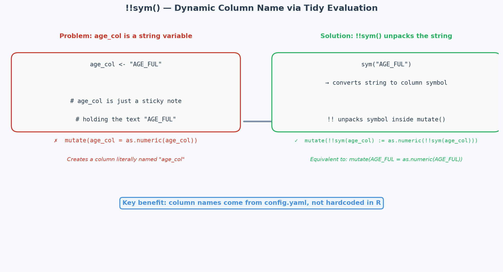

::: {.callout-note icon=false}
## Abstract

During clinical trials, EDC data must be reviewed regularly — from routine medical review reports to formal audit and inspection scenarios. In these contexts, reviewers do not explore data freely. They follow a predictable, structured process and need a document that clearly records what was seen, under what conditions, and what conclusions were drawn. This core distinction shapes the design philosophy presented in this talk.

This lightning talk introduces a two-layer modular framework built with R and Quarto for clinical data review. The first layer provides pre-built review modules covering demographics, adverse events, medication records, and study endpoints — each encapsulating domain knowledge and visualization logic. The second layer allows reviewers to combine modules and map Case Report Form (CRF) fields through a YAML file, without modifying the main codebase.

A key design decision is to use raw CRF data as input rather than CDISC-compliant datasets. This lowers the cognitive barrier for non-programmer reviewers while maintaining flexibility across different trials. Every Quarto report produced by this workflow is a decision snapshot: YAML parameters and review conditions are fully preserved, creating a natural record without additional effort.
:::

---

## 1. Background

Clinical trials can take months or even years to complete. During this time, Statistical Programmers are mainly responsible for submission-ready deliverables — SDTM, ADaM, TLF, and define.xml — all following CDISC standards.

At the same time, another important task is running in parallel: **Data Monitoring**. The Medical team leads this work, and the Statistical Programmer supports by producing tables, listings, and figures (TLFs). These outputs typically cover Protocol-defined endpoints and safety indicators — such as adverse event grade, outcome, relationship, and action taken. They are produced regularly until the Clinical Study Report (CSR) is finalized.

Data Monitoring TLFs have a few clear characteristics:

- **Small in number**: usually fewer than 20 outputs
- **Fixed core variables**: the required fields are focused, and less complex than SDTM or ADaM work
- **Time-sensitive**: results should reflect the latest data as quickly as possible

This creates a practical problem. Following the full SDTM → ADaM → TLF process takes too long. But producing outputs directly from raw CRF data — without any standardization — makes the code hard to maintain and difficult to reuse across trials.

There is another challenge. Every time the Medical team needs a new data cut, the process looks like this: extract data, map variables, write code, generate output, send it back. This back-and-forth typically takes days. And the output often cannot be traced back to the exact filters that were applied.

---

## 2. Design Philosophy

This Modular Workflow was built to solve these problems — without relying on a full CDISC pipeline. The goal is a framework that is **standardized, reusable, and fully traceable**. Here are the four core design decisions:

**YAML configuration drives the entire workflow**

All field mappings, filter conditions, and subject scope are defined in one YAML file. The R code never hardcodes any field names or filter logic. When the data structure changes or the filter conditions need to be updated, only the YAML needs to change — the R code stays the same. This also means Medical reviewers can adjust conditions themselves, without asking the Statistical Programmer to modify the code every time.

**Each TLF type is a separate R function**

This example uses an oncology study. Each output — demographics table, KM plot, waterfall chart, Patient Timeline, and listing — is an independent R function. Adding a new output only requires adding one new module. Changing the style of one chart does not affect any other. This makes the workflow easy to extend, maintain, and reuse.

**All packages are loaded in one place**

All required packages are loaded in a single file, `packages.R`. This avoids repeated declarations across modules and keeps the setup consistent and efficient.

**Every report captures its own filter conditions**

This is the most distinctive part of this design. Every time the Quarto report is rendered, it automatically records at the top: the population condition used, the number of subjects at each filter step, the final subject count, the generation time, and the YAML file path. No extra effort is needed to maintain a review log — the report itself is the audit trail.

---

## 3. Workflow Architecture

At the top level, this workflow is a **two-layer modular framework**:

::: {.callout-tip icon=false}
## Two-Layer Design

**Layer 1 — Module Library** (built by the Statistical Programmer)
Pre-built R functions, one per output type, taking common outputs in the oncology studies as example: demographics table, KM plot, waterfall chart, Patient Timeline, and listing. Each function encapsulates its own domain knowledge and visualization logic. Once written, they do not need to change.

**Layer 2 — YAML Configuration** (adjustable by users, such as the reviewer or programmer)
A single YAML file maps CRF field names, defines filter conditions, and selects which modules to include. Reviewers can change the subject scope or filter conditions here — without touching any R code.
:::

In practice, the Statistical Programmer builds Layer 1 once. After that, a Medical reviewer can adjust Layer 2 on their own — for example, changing a population filter from `SAFFL == 'Y'` to a specific site — and re-render the report to get updated results immediately.

Internally, the workflow is made up of five technical layers that support this two-layer design:

{style="border-radius: 10px;" width="70%"}

| Layer | File | Responsibility |
|-------|------|----------------|
| Configuration | `config/config.yaml` | Field mapping, filter conditions, chart settings |
| Data | `R/00_load_data.R` | Data loading, subject filtering, shared dataset |
| Preprocessing | `R/02_preprocess.R` | Format conversion |
| Module | `R/mod_*.R` | Individual TLF outputs |
| Presentation | `report.qmd` | Connects all modules and renders the report |

The key design principle is **one-way dependency**: each layer only takes data from the layer below it. `report.qmd` calls the modules, modules get data from `load_data()`, and the data layer reads from config. When anything changes, the impact is always predictable.

### Data Layer: `00_load_data.R`

This workflow uses dummy SAS data for demonstration. This reflects real-world practice — most EDC systems can export SAS datasets to the Statistical Programmer.

The data layer handles the most complex logic in the workflow. The key steps are: date standardization (handling SAS Date, haven_labelled, and character formats), a four-step subject filtering process, and building a shared dataset (`common`) so that each module does not need to join the DM data separately.

{style="border-radius: 10px;" width="65%"}

The four-step filtering is fully driven by the `filters` section in the config: base population → specific sites → specific subjects → subject criteria (supporting OR / AND logic). At each step, the number of subjects is recorded in a `filter_log`, which is then displayed in the audit callout at the top of the report.

{style="border-radius: 10px;" width="65%"}

### Preprocessing Layer: `02_preprocess.R`

The preprocessing layer has a narrow, focused responsibility: **format conversion only — no filtering, joining, or renaming**. Three conversions are applied: age field type conversion, AE grade numeric extraction, and lab value string-to-numeric conversion. Each conversion checks whether the column exists before running. If the column is not found, it skips rather than errors — which improves flexibility across different trials.

{style="border-radius: 10px;" width="65%"}

### Module Layer: `mod_*.R`

All `mod_*` functions follow a consistent interface of `(data, config)`:

```r
mod_demographic(data, cfg)
mod_os(data, cfg)
mod_tumor(data, cfg)
mod_timeline(data, cfg)      # Interactive Patient Timeline (Plotly)
mod_listing(df, listing_cfg) # Interactive Listing (DT)
```

Wrapping each output in a function keeps internal variables inside their own scope. Modules are independent from each other and can be called multiple times — for example, `mod_listing` is called once for AE and once for LB.

The Patient Timeline module uses an **Adapter Pattern**: `mod_timeline.R` handles only the rendering logic, while each domain's data transformation is handled by its own adapter — `adapter_ae.R` and `adapter_lb.R`. Adding a new domain only requires creating a new adapter file and registering it. `mod_timeline.R` itself does not need to change.

### Presentation Layer: `report.qmd`

The presentation layer is intentionally simple — **it is the coordinator, not the calculator**:

```r
data <- load_data()   # All loading, filtering, and joining happens here
cfg  <- data$config

mod_demographic(data, cfg)
mod_os(data, cfg)
mod_tumor(data, cfg)
mod_timeline(data, cfg)
```

`load_data()` is called only once. All modules read from the same list, which avoids repeated loading and filtering, and prevents inconsistencies that could come from each module reading data separately. The report uses `embed-resources: true`, producing a single self-contained HTML file that is easy to share and archive.

---

Want to see what the output looks like? Here is a sample report generated from dummy data:

[View Sample Report](../images/useR-lt-report.html){target="_blank"}

---

## 4. Key Technical Design

### The Four Sections of config.yaml

The YAML file is the central control point of the entire workflow. It is divided into four sections:

```yaml
# Section 1: fields — field mapping
fields:
  ae:
    subject_col: PT
    term_col:    AETERM_FUL
    grade_col:   AETOXGR_FUL

# Section 2: filters — filter conditions
filters:
  global:
    population: "SAFFL == 'Y'"
  subject_criteria:
    combine: "OR"
    criteria:
      - {label: "Grade 3+ AE", domain: ae, condition: "GRADE_NUM >= 3"}

# Section 3: timeline — Patient Timeline layer settings
timeline:
  reference_date_col: RFSTDTC
  layers:
    - domain: ae
      type: bar
      color_by: AETOXGR_FUL

# Section 4: listings — listing columns and sort order
listings:
  - domain: ae
    sort_by: [PT, AESTDAT_FUL]
    columns:
      - {col: AETERM_FUL, label: "AE Term"}
      - {col: AETOXGR_FUL, label: "Grade"}
```

Changing filter conditions, switching subject scope, or adjusting listing columns — all of this is done in the YAML. The R code does not change.

### The Traceable Audit Callout

Every Quarto report automatically generates a full record of review conditions at the top:

```
Base Population: SAFFL == 'Y' — 45 subjects
Subject Criteria (OR):
  - Grade 3+ AE → 12 subjects
Final Subject List: 12 subjects
Generated: 2026-06-15 14:32:05 | Config: config/config.yaml
```

This record is generated automatically from `filter_log`. No extra maintenance is needed. When someone asks "what did we see at last check, and under what conditions?" — the answer is always in the file.

---

## 5. Five R Functions Worth Knowing

These five functions are the key tools that make this workflow config-driven and portable. They are also useful in any R workflow that needs to be shared or reused across projects.

### `here::here()` — Portable file paths

```r
source(here::here("R", "packages.R"))
```

`here()` finds the project root by looking for a `.git` or `.Rproj` file, then builds paths from there. Whether you run the code from RStudio, a terminal, or a different computer, the path always works. This is what makes the whole project easy to share and reproduce.

### `!!sym()` — Dynamic column names

```r
# age_col is a string read from config, with value "AGE_FUL"
mutate(!!sym(age_col) := as.numeric(!!sym(age_col)))
# Same as: mutate(AGE_FUL = as.numeric(AGE_FUL))
```

`sym()` converts a string into a column symbol. `!!` unpacks it inside a dplyr verb. `:=` is required when the left side uses `!!`. This lets all dplyr operations be driven by column names from the config, instead of being hardcoded.

{style="border-radius: 10px;" width="65%"}

### `map_chr()` — Extract values from a nested list

```r
# col_specs is a list of lists read from the columns: section in config
map_chr(col_specs, "col")    # → c("PT", "ARM", "AETERM_FUL", ...)
map_chr(col_specs, "label")  # → c("Subject ID", "Treatment", "AE Term", ...)
```

`purrr::map_chr()` applies the same key to every element in a list and returns a character vector. This makes it easy to flatten the nested structure that comes from reading YAML into R.

### `setNames()` — A named vector for forward and reverse lookup

```r
col_map <- setNames(
  map_chr(col_specs, "col"),    # values = actual column names
  map_chr(col_specs, "label")   # names  = display labels
)
# Result: c("Subject ID" = "PT", "Treatment" = "ARM", "AE Term" = "AETERM_FUL", ...)
```

This named vector supports both directions: `select(all_of(col_map))` selects and renames columns in one step. `names(col_map)[col_map == "PT"]` looks up the display label for a given column name — which is needed when applying `sort_by` after the columns have already been renamed.

### `keep()` — Filter a list by condition

```r
ae_listing_cfg <- keep(cfg$listings, ~.x$domain == "ae")[[1]]
mod_listing(data$ae, ae_listing_cfg)
```

`purrr::keep()` applies a condition to each element of a list and returns only the ones that match. Here, it finds the listing config where `domain == "ae"` and passes it to `mod_listing()`. Adding a new listing only requires updating the YAML — `report.qmd` does not need to change.

---

## 6. Closing Thoughts

Time savings, traceability, reusability, and a low adoption barrier — these four advantages make this Modular Reporting Workflow a practical improvement for both the Medical team and the Statistical Programmer in Data Monitoring tasks.

For **Statistical Programmers**: once the workflow is built, the next trial only needs a new YAML file and raw data. The core R code stays the same. Data Monitoring reports that used to take days can now be produced in hours.

For **decision makers**: every report comes with a complete record of its filter conditions. There is no need to maintain a separate review log. Reviewing historical results or preparing for an audit becomes much simpler. The tools are built on open-source R packages — no additional licensing cost, and no high adoption barrier.

This workflow was demonstrated using simulated CRF data, but the design is trial-agnostic. Field names, filter conditions, and TLF types are all controlled through YAML. The same framework can be applied directly to a different trial.
