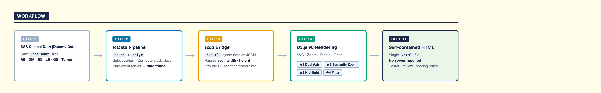
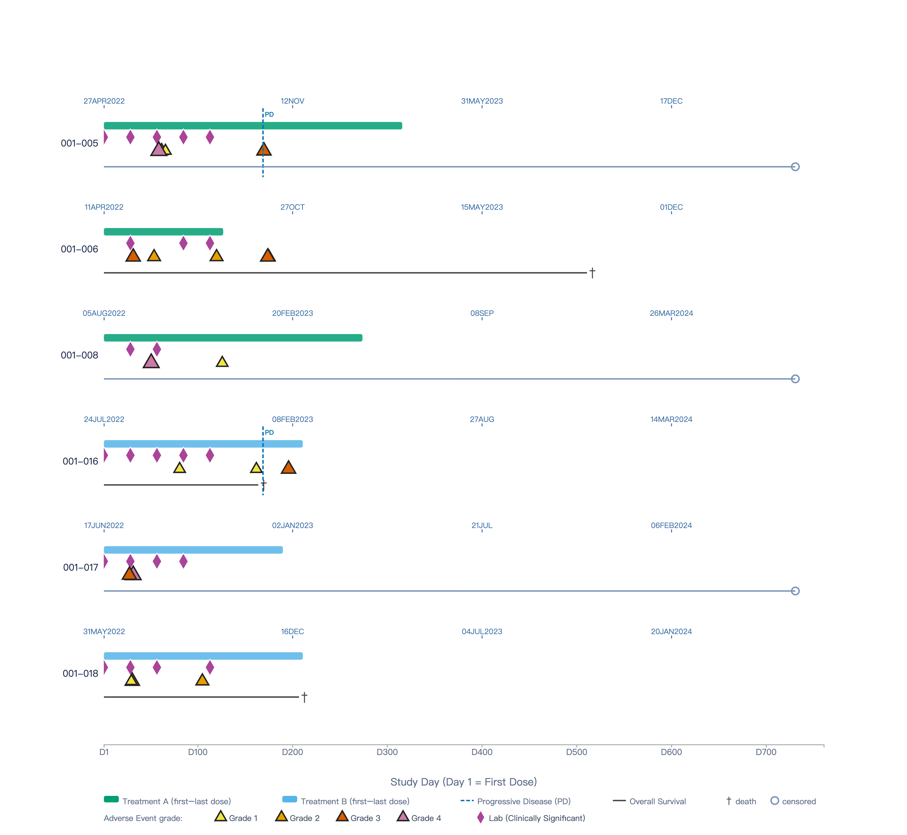
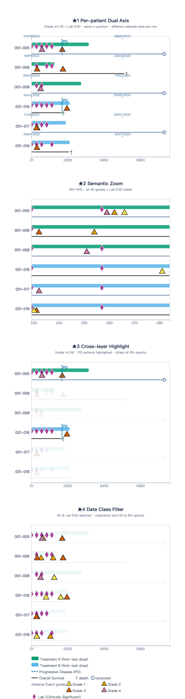

::: {.callout-note icon=false}
## Abstract

Clinical trial data analysis typically focuses on specific analysis datasets, but the complete journey of individual patients — from screening, enrollment, and first dose, through visit records and adverse events, to last dose and survival status — represents critical time-based data points that reviewers prioritize. This fragmentation of information forces reviewers to switch between multiple reports during in-depth case reviews.

This poster presents an interactive patient timeline visualization system built with R and D3.js. The single-patient view integrates visit records, medication history, adverse events, and survival status into a clear timeline, providing a complete picture of each patient's key trial journey.

The system also supports side-by-side timeline comparisons across patient subgroups, with event type filtering and time range zoom functionality to help identify population-level event patterns and safety signals.

The system takes raw CRF data as input and embeds D3.js interactive capabilities directly into the R workflow, without requiring a separate front-end development environment. This poster will demonstrate visualizations generated from simulated clinical trial data and discuss the practical potential of this approach in clinical data review and safety monitoring settings.
:::

---

## 1. Background

In clinical trial data exploration, the right visualization makes it easier to find and understand important information. However, a patient's complete trial journey — from enrollment and first dose, through visits and adverse events, to survival status — is often spread across multiple reports. Reviewers need to switch back and forth between different outputs just to piece together what happened to one patient.

D3.js is a JavaScript library that works directly at the level of SVG elements. It does not offer ready-made chart types. Instead, it gives you the tools to bind data to visual elements and control every detail of the output. The customization is almost unlimited.

> **A SAS analogy:** D3.js is to ggplot2 what `PROC TEMPLATE / GTL` is to `PROC SGPLOT` — complete control, complete responsibility.

---

## 2. Design Philosophy

This poster uses a simulated oncology clinical trial as a demonstration.

The design focuses on four strengths:

**Highly customizable visual language**

D3.js uses different DOM elements — rectangles, paths, lines, and text — to build visual structures that standard statistical plotting tools cannot easily produce. In this poster's timeline chart, five event types (AE, medication, Lab, disease progression, survival) are drawn as separate layers. The position, color, and shape of each layer is fully independent.

**Seamless integration between R and JavaScript**

The `r2d3` package lets R pass data directly to a D3.js script as JSON. No separate front-end environment is needed. The entire workflow runs inside a Quarto document and produces a single self-contained HTML file.

**Responsive chart interactions**

D3.js updates SVG element attributes directly. When you zoom in, the chart does not redraw from scratch — it just updates the coordinates of each element. The browser then refreshes only what changed. This makes interactions feel fast and smooth, which is useful for live demonstrations.

**A data structure that works well with multiple layers**

In this demo, different types of events — AE, medication (EX), Lab (LB), disease progression (PD), and overall survival (OS) — are stored in one flat table. In the chart, each event type is its own independent layer. Showing or hiding a layer requires only a small change.

---

## 3. Core Program Architecture

The system is built from four core files, each with a clear responsibility:

{style="border-radius: 10px;" width="200%"}

| File | Layer | Responsibility |
|---|---|---|
| `R/prep_timeline_data.R` | Data | Read 6 SAS7BDAT files → select patients → combine 6 event types → output `timeline_df` |
| `d3/timeline.js` | Visual (interactive) | Receive JSON → draw interactive timeline (zoom, highlight, filter, tooltip) |
| `d3/poster.js` | Visual (static) | Receive the same JSON → draw a static 4-panel poster figure (★1–★4) |
| `patient-timeline.qmd` | Presentation | Run R data prep → call two r2d3 → output self-contained HTML |

### Data Layer: `prep_timeline_data.R`

The data layer reads 6 SAS7BDAT files (dm, ae, ex, os, tumor, lb). It selects patients and combines all event records into one flat, long-format data frame called `timeline_df`. Each row represents one event.

```r
# Combine 6 event types into one table
timeline_df <- bind_rows(ae_events, ex_events, visit_events,
                         os_events, pd_events, lb_events) %>%
  mutate(trtsdtc = as.character(trtsdtc))  # Convert Date to string for JSON
```

All events share a common time axis: **Study Day** (Day 1 = first dose date). The 10 columns cover event type, start and end day, AE grade, drug action, and survival status.

### Visual Layer: `timeline.js` (interactive) and `poster.js` (static)

Both D3.js scripts receive the same `timeline_df`, but serve different purposes:

- **`timeline.js`**: Used for live demonstration. Includes full interactive features — zoom, cross-layer highlight, data class filter, and tooltip.
- **`poster.js`**: Used for the printed poster. Draws 4 static panels using a `drawPanel()` function, each showing the result of one interactive feature as a snapshot.

### Presentation Layer: `patient-timeline.qmd`

The presentation layer has only 10 lines of effective code. Its job is simple:

```r
source(here("R", "prep_timeline_data.R"))   # Run data prep; timeline_df enters the environment

r2d3(data = timeline_df, script = here("d3", "timeline.js"),
     width = 1840, height = 1696, d3_version = 6)   # Interactive chart

r2d3(data = timeline_df, script = here("d3", "poster.js"),
     width = 840, height = 3160, d3_version = 6)    # Static 4-panel chart
```

`timeline_df` is computed only once. Both `r2d3` calls share the same data. When Quarto renders the document, the two SVG widgets are placed one after another in the same HTML page.

---

## 4. From Code to Browser — What Happens at Each Step

```
prep_timeline_data.R
  └─ Produces timeline_df (R data frame)
        │
        ├─ r2d3() serializes timeline_df to JSON
        │    └─ Bundles the D3 script, JSON data, and svg/width/height into an HTML widget
        │
        ├─ Quarto render
        │    └─ Places the two widgets one after another, applies YAML format settings
        │    └─ self-contained: true → all JS, CSS, and data are inlined into one HTML file
        │
        └─ User opens patient-timeline.html
             └─ Browser runs the D3 script, reads JSON data, renders SVG in real time
```

| Step | Where it runs | Output |
|---|---|---|
| `prep_timeline_data.R` | Your computer (R) | `timeline_df` (R data frame) |
| `r2d3()` | Your computer (R) | HTML widget (JSON + script bundled) |
| `quarto render` | Your computer (Quarto) | `patient-timeline.html` (single file) |
| Open HTML | User's browser (JavaScript) | SVG rendered live, interactions ready |

The key point is: **the HTML file contains no image pixels — only data and drawing instructions**. The actual drawing happens in the browser. This is why interactions feel so fast. Zooming and highlighting only update the coordinate attributes of SVG elements. No request is sent to a server, and no image is re-generated.

> This HTML file works completely offline — no internet, no R, no server of any kind.

---

## 5. Four Key Interactive Features

{style="border-radius: 8px;" width="100%"}

[▶ Open the interactive timeline (opens in new tab)](../images/useR-poster-patient-timeline.html){target="_blank" .btn .btn-outline-primary style="font-size:0.9em; margin-bottom:1em;"}

### ★1 Per-patient Dual Axis (calendar dates on top / study days on bottom)

The bottom x-axis shows a shared Study Day scale for all patients (starting from Day 1). The top axis shows each patient's own calendar dates, calculated from their individual first dose date. At the same x position, different patients show different calendar dates.

D3.js makes this possible by drawing a separate top axis for each patient inside the rendering loop, using that patient's first dose date as the starting point.

### ★2 Semantic Zoom

When you scroll to zoom in, the bottom axis automatically recalculates its tick spacing based on the new visible range. The top axis calendar dates update at the same time. When the zoom level reaches 3× or more, Grade 1–2 AE events fade in. Zooming back out returns to the overview showing only Grade ≥3.

This is called semantic zoom: the chart responds to zoom level with a change in what is displayed, not just a change in scale. D3.js achieves this with `rescaleX()`, which produces a new scale function based on the current zoom transform.

### ★3 Cross-layer Highlight

Hovering over any event belonging to a patient — an AE triangle, a medication bar, a Lab diamond, or a PD line — highlights all layers for that patient at once (opacity = 1). All other patients fade to 8%. The top axis follows along too.

The key is **DOM class design**. Every SVG element carries two classes: one for the event type (for example, `ev-ae`) and one for the patient (for example, `subj-001_005`). On hover, the code first sets all `.ev` elements to 8%, then pulls back all elements with the matching patient class to 100%. One line covers all layers at once.

### ★4 Data Class Filter

Five clickable filter buttons appear at the bottom of the legend: `AE`, `EX`, `LB`, `PD`, and `OS`. Clicking a button highlights that event type and dims the others to 8%. Multiple selections are supported. This helps reviewers focus on specific event types in a busy multi-patient view — for example, looking at AE events and Lab abnormalities side by side.

The filter state and the highlight state work correctly together. On mouseout, the code does not simply set opacity back to 1. Instead, it calls `applyTypeFilter()` to re-apply the current filter state, so the two effects do not conflict.

---

## 6. Static Poster Figure (`poster.js`)

Interactive features cannot be printed on paper. `poster.js` captures the effect of each feature as a static snapshot, arranged in four vertical panels:

{style="border-radius: 8px;" width="60%"}

| Panel | Feature shown | How it is captured |
|---|---|---|
| ★1 | Per-patient dual axis | Full time range, Grade ≥3 only, top axis visible |
| ★2 | Semantic zoom | `xDomain = [29, 84]` (Week 4–12), all grades shown |
| ★3 | Cross-layer highlight | PD patients at full opacity, others at 8% |
| ★4 | Data class filter | AE + LB highlighted, EX / PD / OS at 8% |

All the variable behavior for each panel — x-axis range, grade filter, highlight target — is passed as a config object to `drawPanel()`. The drawing logic itself does not change:

```js
drawPanel({
  panelIdx:      1,
  xDomain:       [29, 84],       // Zoomed in to Week 4–12
  gradeFilter:   () => true,     // Show all grades (simulates zoomed-in view)
  highlightSubj: null,
  highlightTypes: null,
  showTopAxis:   false,
  title:         "★2  Semantic Zoom",
  subtitle:      "W4–W12 · all AE grades + Lab (CS) visible"
});
```

---

## 7. Closing Thoughts

D3.js has a steeper learning curve than most R plotting tools. It requires more code, and a basic understanding of how SVG elements work. But for the data exploration phase of a clinical trial, its high flexibility and rich interactive features offer something that standard tools cannot easily match. When a chart can show the data in more ways, different insights and decisions tend to follow.

For **Statistical Programmers**: through the `r2d3` package, D3.js fits directly into an existing R and Quarto workflow. No separate front-end environment is needed. R handles the data; D3.js handles the visual output. Each does what it does best.

For **clinical data reviewers**: an interactive timeline brings a patient's full trial journey — medication, adverse events, Lab abnormalities, disease progression, and survival — into one view. Less time switching between reports, more time understanding the data.
