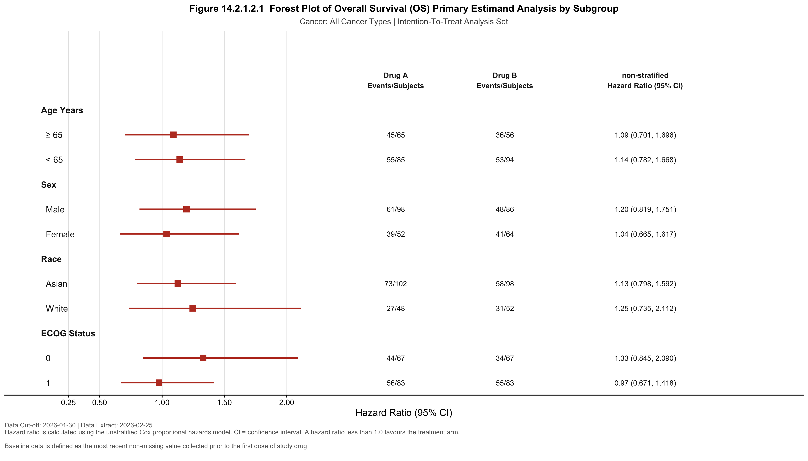

```{r setup}
# Run forest_template.R before rendering to ensure data, plot, and YAML are in sync.
# All output files (PNG, RTF, RDS) are regenerated automatically on each render.
capture.output(source("forest_template.R"), file = nullfile())

library(tidyverse)
library(yaml)
library(knitr)
library(kableExtra)

# Read YAML config and analysis results produced by forest_template.R
config    <- read_yaml("forest_config.yaml")
dat       <- readRDS("forest_data.rds")
forest_df <- dat$forest_df
```

---

## Report Information

```{r report-header}
tibble(
  Field = c("Protocol", "Data Cut-off", "Data Extract",
            "Figure Number", "Analysis Set"),
  Value = c(config$report$protocol,
            config$report$data_cutoff,
            config$report$data_extract,
            config$report$figure_number,
            config$report$analysis_set)
) %>%
  kable(col.names = c("", ""), align = c("l","l")) %>%
  kable_styling(full_width = FALSE, position = "left",
                bootstrap_options = c("striped","condensed")) %>%
  column_spec(1, bold = TRUE, width = "12em")
```

---

## Review Conditions

> This section records the exact parameters used to generate this report.
> Any future reproduction using the same `forest_config.yaml` will produce identical results.

```{r review-conditions}
tibble(
  Parameter = c(
    "Analysis Endpoint",
    "Endpoint Label",
    "Analysis Set",
    "Cancer Type Filter",
    "Cancer Type Label",
    "Treatment Arm",
    "Control Arm",
    "Reference Arm (Cox)",
    "CI Level",
    "Statistical Model",
    "Subgroups",
    "Generated At"
  ),
  Value = c(
    config$endpoint$param,
    config$endpoint$label,
    config$report$analysis_set,
    config$cancer_filter$selected,
    config$cancer_filter$label,
    config$treatment$trt_arm,
    config$treatment$ctrl_arm,
    config$treatment$ref_arm,
    paste0(config$stats$ci_level * 100, "%"),
    config$stats$model,
    paste(sapply(config$subgroups, function(x) x$group), collapse = ", "),
    format(Sys.time(), "%Y-%m-%d %H:%M")
  )
) %>%
  kable(col.names = c("Parameter", "Value"), align = c("l","l")) %>%
  kable_styling(full_width = FALSE,
                bootstrap_options = c("striped","condensed")) %>%
  column_spec(1, bold = TRUE, width = "16em") %>%
  row_spec(4, background = "#fff3cd")  # Highlight cancer type filter row
```

---

## Dataset Summary

```{r dataset-summary}
is_all <- config$cancer_filter$selected == "ALL"

if (is_all) {
  # No filter applied: show total subjects and treatment arm counts
  tibble(
    Description = c(
      "Total subjects",
      paste0("  ", config$treatment$trt_arm),
      paste0("  ", config$treatment$ctrl_arm)
    ),
    N = c(
      dat$n_total,
      dat$n_trt,
      dat$n_ctrl
    )
  ) %>%
    kable(col.names = c("Description", "N"), align = c("l","r")) %>%
    kable_styling(full_width = FALSE,
                  bootstrap_options = c("striped","condensed")) %>%
    column_spec(1, width = "24em") %>%
    row_spec(1, bold = TRUE, background = "#d4edda")
} else {
  # Filter applied: show subject counts before and after filtering
  tibble(
    Description = c(
      "Total subjects (before filter)",
      paste0("Cancer Type = ", config$cancer_filter$selected, " (after filter)"),
      paste0("  ", config$treatment$trt_arm),
      paste0("  ", config$treatment$ctrl_arm)
    ),
    N = c(
      dat$n_total,
      dat$n_cancer,
      dat$n_trt,
      dat$n_ctrl
    )
  ) %>%
    kable(col.names = c("Description", "N"), align = c("l","r")) %>%
    kable_styling(full_width = FALSE,
                  bootstrap_options = c("striped","condensed")) %>%
    column_spec(1, width = "24em") %>%
    row_spec(2, bold = TRUE, background = "#d4edda")
}
```

---

## Forest Plot

```{r forest-plot, fig.width=14, fig.height=8}

```

---

## Interpretation

```{r interpretation}
# Dynamic interpretation: count subgroups where HR < 1 (favours treatment arm)
sub_results <- forest_df %>%
  filter(!is_header & !is.na(hr))

n_favour_trt  <- sum(sub_results$hr < 1,  na.rm = TRUE)
n_total_sub   <- nrow(sub_results)
hr_range_low  <- min(sub_results$hr, na.rm = TRUE)
hr_range_high <- max(sub_results$hr, na.rm = TRUE)
hr_below_1    <- sub_results %>% filter(hr < 1)  %>% pull(label) %>% trimws()
hr_above_1    <- sub_results %>% filter(hr >= 1) %>% pull(label) %>% trimws()
```

Among **`r config$cancer_filter$label`** patients, 
**`r config$treatment$trt_arm`** showed a HR below 1.0 in 
**`r n_favour_trt`** out of **`r n_total_sub`** subgroups 
(HR range: `r hr_range_low` – `r hr_range_high`),
suggesting a consistent trend favouring the treatment arm across most subgroups.

Subgroups favouring **`r config$treatment$trt_arm`** (HR < 1.0):
`r paste(hr_below_1, collapse = ", ")`.

Subgroups not favouring **`r config$treatment$trt_arm`** (HR ≥ 1.0):
`r if(length(hr_above_1) == 0) "None" else paste(hr_above_1, collapse = ", ")`.

> **Note:** This interpretation is generated automatically from the data.
> No formal interaction test was performed in this review document.
> Statistical significance of subgroup differences should be assessed separately.

---

## Footnotes

`r config$text$footnote_method`

`r config$text$footnote_data`

---

*Report generated using `forest_config.yaml` — all review conditions are fully preserved above.*
